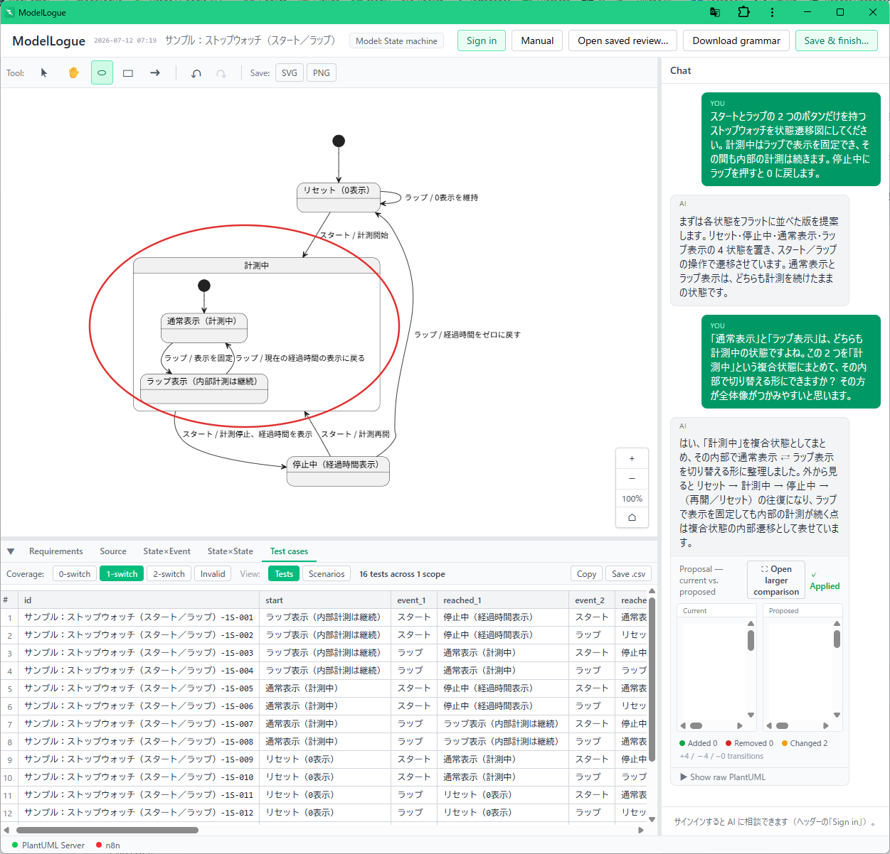
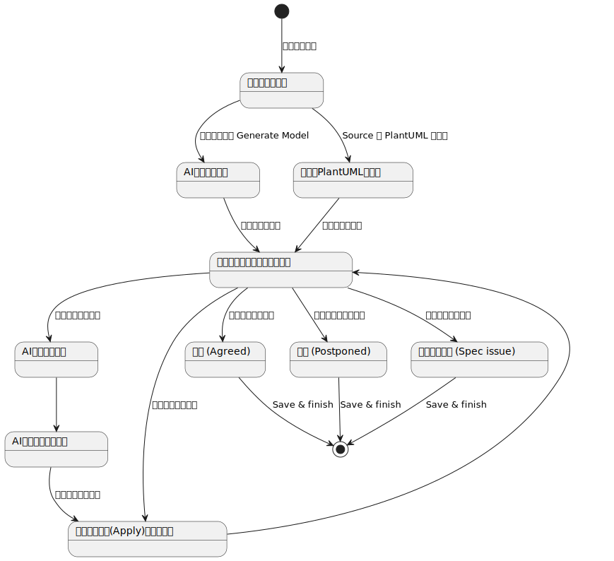
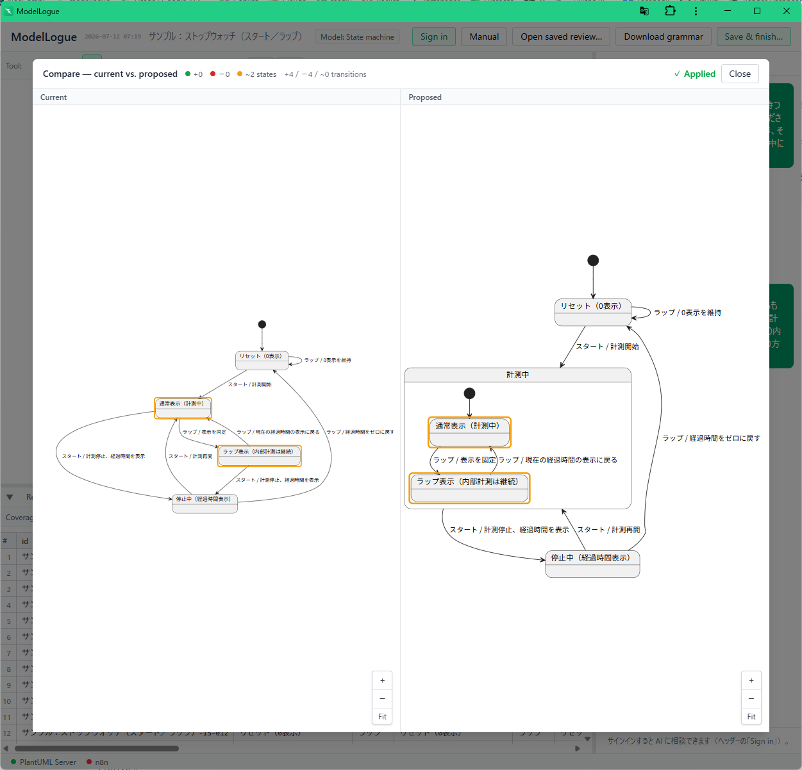

# ModelLogue ユーザーマニュアル

**対象バージョン**: v7.x（3 モデル型対応）
**言語**: 日本語

---

ModelLogue は、ソフトウェア開発における **モデルレビュー** を支援するツールです。

レビュー中の図は `Apply` のたびに更新され、常にその時点の最新のモデルが表示されます。
適用した変更は版として記録され、図ツールバーの **Undo / Redo** で前の版に戻したり、やり直したりできます。

レビューの成果は、**Save & finish** で保存する証跡 JSON に残ります。
そこには、最終的に合意したモデルのソース、反映のたびの版の履歴、そこに至る対話ログ、マーカー、結論が入ります。
図に付けるマーカーは指摘を書き留めるための一時的な注釈で、図の画像には書き出されません。

## このマニュアルの構成

共通の使い方はこのページに、モデル型ごとの固有の書き方・読み方は分冊にまとめています。

| ページ | 内容 |
|-------|------|
| **このページ** | 画面構成、はじめかた、共通機能（チャット・マーカー・保存など） |
| [状態遷移図（State machine）](state-machine.md) | 状態と遷移のモデル。遷移表と N-switch テストケース |
| [要求図（Requirement）](requirement.md) | SysML 風の要求図。トレーサビリティと孤立要求 |
| [プロセス図（Process）](process.md) | 業務フロー／アクティビティ図。シナリオ・ロール・成果物 |

まず本ページで全体像をつかんでから、扱うモデル型のページに進んでください。

## 対象読者

- 設計モデル（状態遷移・要求・業務フロー）を **レビューする人**（ファシリテーター）
- レビューに参加して図や要求を確認する人

事前の PlantUML の知識は必須ではありません。要求文を書いて **AI にモデルを生成してもらう** ところから始められます。

---

## 画面の全体像

 サインイン済み（＝ AI が使える通常状態）では、画面は次の 4 領域で構成されます。



```
┌──────────────────────────────────────────────────────────┐
│ ヘッダー：モデル型セレクタ / Open saved review / Save & finish │
├──────────────────────────────────┬───────────────────────┤
│  図ビュー（PlantUML SVG ＋ マーカー） │                       │
│  ├ ツールバー：選択/パン/楕円/矩形/矢印  │   AI チャット           │
│  │            Undo・Redo・図の保存    │  （提案の適用もここ）    │
│  ├────────────────────────────────┤                       │
│  分析パネル：Requirements / Source     │                       │
│           ＋ モデル型ごとのタブ         │                       │
├──────────────────────────────────┴───────────────────────┤
│ ステータスバー：PlantUML Server / n8n の接続状態              │
└──────────────────────────────────────────────────────────┘
```

- **左側** … モデル図（上）と分析パネル（下）。境界はドラッグで高さを調整できます。
- **右側** … AI チャット。境界はドラッグで幅を調整できます。
- 分析パネルのタブは、**Requirements**・**Source** の共通タブに続いて、
  選択中のモデル型に応じたタブ（遷移表・トレーサビリティ・シナリオなど）が並びます。

---

## AI 連携は標準の動作です

ModelLogue のレビューは **AI との対話を前提** に設計されています。
通常状態では、画面右側の AI チャットで、要求からのモデル生成・修正提案・指摘への応答を
チャット越しに行います。

### サインインしていないときは「入力欄」だけが出ません

チャット枠（これまでの対話の履歴）は、サインインの有無にかかわらず **常に表示** されます。
公開デモサイトで匿名の閲覧者に対して隠れるのは、**メッセージの入力欄だけ** です。

- 匿名でも、図の閲覧・ソース編集・分析タブ・マーカー・保存に加え、
  **開いたレビューの対話ログを読む** ことができます（下記のサンプルや、共有されたレビューをそのまま読めます）。
- ただし新しくメッセージを送ったり、要求からモデルを生成したり（Generate Model）はできません。
  入力欄の場所には「サインインすると送信できる」旨が表示されます。
- AI を使いたくなったら、ヘッダー右上の **「Sign in」** ボタンを押します。認証（サインイン）に進み、
  戻ってくると **AI が有効化** され、入力欄と Generate Model が使えるようになります。
- ローカル開発環境やオフラインのデモ（モック AI モード）では、サインインなしでも入力欄が出ます。

> **まとめ**：対話ログは誰でも読めます。**送信（AI との新規のやり取り）だけ** がサインインを必要とします。

AI を使えるかどうかは、**認証された利用者かどうか**（本人確認）で決まり、
サーバー側で最終的に判定・保護されています。画面側の出し分けは補助的なものです。

---

## はじめかた（シード → レビューの流れ）

セッションは大きく 2 つの段階を通ります。

1. **シード（Seed）段階** … これから何をレビューするかを用意する段階。
   モデル型を選び、最初のモデルを作ります。
2. **レビュー（Review）段階** … 最初のモデルが確定してから。
   AI と対話しながら図を磨き、指摘を書き込み、結論を出します。

この流れを状態遷移図にすると次のようになります。



この図自体が状態遷移図サブセットに準拠しており、そのまま ModelLogue に読み込めます
（ModelLogue で自分のレビュー工程をレビューして作った図です）。
ソース: [review-workflow.puml](assets/review-workflow.puml)

「モデル型を選択 → 初期モデル作成」までがシード段階、「モデルの確認・マーカー付け」以降のループが
レビュー段階です。保存済みレビューを `Open saved review…` で開いた場合は、シードを飛ばして
「モデルの確認・マーカー付け」から再開します。

### Step 1. モデル型を選ぶ

ヘッダーの **「Model:」** セレクタで、扱うモデル型を選びます（State machine / Requirement / Process）。

- モデル型を選べるのは **シード段階だけ** です。
- 最初のモデルが確定するとロックされ、ヘッダーは `Model: 〇〇` の表示に変わります。
- シード中に入力済みの内容がある状態で型を切り替えると、
  「seed 入力（ソース・要求・チャット）が消えます」という確認が出ます。

### Step 2. 最初のモデルを用意する

用意のしかたは 3 通りあります。

- **A. 要求から AI に生成させる（推奨）**
  分析パネルの **Requirements** タブに、モデルが満たすべき要求文を貼り付け／入力し、
  **「Generate Model」** を押します。AI が対応するモデル型のソースを生成し、図に反映されます。
- **B. ソースを直接貼る**
  **Source** タブに、そのモデル型の PlantUML（サブセット）ソースを直接書く／貼り付けます。
- **C. 保存済みレビューを開く**
  ヘッダーの **「Open saved review…」** で、以前保存した `.json` を開いて続きから再開します
  （後述）。

いずれかで最初のモデルが確定すると、レビュー段階に入ります。

### Step 3. AI と対話してモデルを磨く

右側のチャットで AI に相談します。「この遷移が抜けている」「この要求を分解して」など、
自然文で指示できます。AI はモデルの修正案（新しいソース）を返します。

- 送信は **Ctrl / Cmd + Enter**（または Send ボタン）。
- 反映のしかたはモデル型で異なります（詳細は各分冊）。
  - 状態遷移図 … 変更前／変更後の **提案ビュー** を見て、**Apply** で反映。
  - 要求図・プロセス図 … 提案は **自動で反映** され、変更箇所が図の上に自動マーカーで示されます。

### Step 4. 指摘をマーカーで書き込む

図の上に、楕円・矩形・矢印で指摘を描き込めます（後述）。

### Step 5. 結論を出して保存する

ヘッダーの **「Save & finish…」** で、結論（合意／保留／仕様側の課題）を選び、
会話・モデル・マーカーを含む **証跡 JSON** をダウンロードします（後述）。

---

## 共通機能の詳細

### Requirements タブ

- モデルが満たすべき要求文を書く場所です。
- **シード段階のみ編集可能**。モデルが確定するとレビュー段階では読み取り専用になります。
- 文字数の目安（ソフト上限）を超えると警告色になり、ハード上限（8,000 文字）を超えると
  Generate Model が押せなくなります。長い場合は該当箇所だけ抜き出してください。
- **Generate Model** … この要求文を使って「モデルを生成して」と AI に送るショートカットです。

### Source タブ

- そのモデル型の PlantUML（サブセット）ソースを直接編集できます。
- ModelLogue は PlantUML 完全互換ではなく、レビュー目的に絞った **モデル型ごとの最小サブセット**
  だけを受け付けます。対応構文は各分冊を参照してください。
- 各モデル型のページ末尾に、その型が受け付ける **文法定義（EBNF）の全文** を載せています。
  これはそのまま AI に貼り付けて「この文法に従って生成して」と指示に使えます
  （ModelLogue 自身も同じ定義を AI への指示に使っています）。
- ヘッダーの **「Download grammar」** ボタンは、状態遷移図の文法（`stateDiagram.ebnf`）を
  テキストとして保存します。

### AI チャット

- 右側のパネル。あなたの発言は右（インディゴ）、AI は左（グレー）に表示されます。
- （Slack 連携が有効な環境では、Slack から参加した人の発言が緑のふちどりで左側に表示されます。）
- AI が「変更後のソース」を含む提案を返すと、モデル型に応じて提案ビューや自動反映につながります。

### 提案の反映と Undo / Redo

- モデルへ反映した変更は、図ツールバーの **↶（Undo）／↷（Redo）** で戻す・やり直しできます。
- Undo/Redo ボタンは常に表示され、空のモデルまで戻してもやり直せます。
- AI の提案は、反映の前後を **比較ビュー（current vs. proposed）** で確認できます。追加・削除・変更された状態や遷移がハイライトされます。



### マーカー（図への指摘）

図ツールバーの **Tool:** で描画ツールを選び、図の上に指摘を描けます。

| ツール | 説明 |
|-------|------|
| 選択（ポインタ） | 既存マーカーの選択・移動・リサイズ |
| パン（✋） | キャンバスをドラッグして移動 |
| 楕円（⬭）／矩形（▭）／矢印（➜） | ドラッグで新しいマーカーを描画 |

- 色は **赤・青・緑・紫の 4 色** から、未使用の色が自動で割り当てられます。
  4 色すべて使用中のときは、いずれかを消すと新しく描けます。
- 選択すると四隅（矢印は両端）に **ハンドル** が出て、移動・リサイズできます。
- 削除は **Delete キー**、またはマーカーを右クリックです。
- **自動マーカー**（要求図・プロセス図）… AI の提案を反映すると、変更箇所が自動で枠取りされます。
  **追加＝緑の実線**、**変更＝アンバー（橙）の破線**。これは作業用の目印で、選択や色割り当ての対象外です。
  ソースを変更すると消え、次の反映で描き直されます。

> マーカーは **揮発的な作業レイヤー** です。図の画像エクスポート（下記 SVG/PNG）には含まれません。
> レビューの記録として残したい場合は、次の **Save & finish** の証跡 JSON を使ってください
> （マーカーも JSON に保存されます）。

### 図の操作と画像保存

- 右下のズームコントロールで **＋ / −（拡大・縮小）**、**100%（等倍）**、**⌂（中央に戻す）** ができます。
  マウスホイールでもズームできます。
- 図ツールバーの **Save:** で、モデル図を **SVG（ベクター）** または **PNG（画像）** として保存できます。
  マーカーは含まれません。

### Save & finish（証跡の保存）

ヘッダーの **「Save & finish…」** から、レビューの結論を選んで証跡 JSON をダウンロードします。

- **結論（Outcome）** を 1 つ選びます。
  - **Agreed** … すべての懸念が解消され、モデルが承認された。
  - **Postponed** … 未解決の論点が残る。フォローアップのレビューで続ける。
  - **Spec issue** … 障害は上流にある。要求の側を直さないとモデルを進められない。
- 任意で **メモ** を残せます。
- **Download JSON** を押すと、次を含む 1 ファイルがダウンロードされます。
  最終ソース、要求テキスト、全チャットログ、反映のたびのソース履歴、マーカー、結論とメモ、セッション情報。

### Open saved review（再開）

ヘッダーの **「Open saved review…」** で、保存済みの `.json` を開けます。

- 会話を含む **完全なレビュー**（Save & finish で保存したもの）を開くと、会話・履歴・マーカー・モデルまで
  まるごと復元され、**議論の続き** ができます。
- 会話を含まない **シード用の素材**（ソースや要求だけのファイル）を開くと、それを種として新しいセッションを開始します。
- URL に **`?file=<JSON の URL>`** を付けて起動すると、その JSON を起動時に読み込みます
  （ネット公開されたレビュー証跡を、リンクひとつで開くための仕組み）。読み込みはサインインの有無に
  関係なく行われ、読み込んだ内容の閲覧に認証は要りません。

### 例を開く（サンプル）

公開しているサンプルのレビュー証跡を、リンクひとつでツールに読み込んで、図・対話ログ・結論を確認できます。

- **ModelLogue のレビュー工程**（ModelLogue 自身のレビュー作業を状態遷移図でレビューした記録）
    - アプリで開く: [modellogue.com で開く →](https://modellogue.com/app/?file=https://sho1884.github.io/public-files/ModelLogue/Samples/review-workflow.json)
    - JSON を直接見る: [review-workflow.json](https://sho1884.github.io/public-files/ModelLogue/Samples/review-workflow.json)
- **ストップウォッチ（スタート／ラップ）**（2 つのボタンだけのストップウォッチを状態遷移図でレビューした記録。「計測中」を複合状態でまとめた例）
    - アプリで開く: [modellogue.com で開く →](https://modellogue.com/app/?file=https://sho1884.github.io/public-files/ModelLogue/Samples/stopwatch.json)
    - JSON を直接見る: [stopwatch.json](https://sho1884.github.io/public-files/ModelLogue/Samples/stopwatch.json)

「アプリで開く」は、公開中の [modellogue.com](https://modellogue.com/) でそのまま開く例です。自分で別のアドレスに
公開している場合は、`https://modellogue.com` の部分をそのアドレスに読み替えてください。手元に保存した `.json` は、
ヘッダーの **「Open saved review…」** からも開けます。サンプルは今後増える予定です。

### ステータスバー

画面最下部に、**PlantUML Server**（図の生成）と **n8n**（AI 中継）の接続状態が
緑（接続）／黄（確認中）／赤（未接続）で表示されます。図が出ない・AI が応答しないときの切り分けに使えます。

---

## 次に読む

- 状態と遷移をレビューする → [状態遷移図（State machine）](state-machine.md)
- 要求とトレーサビリティをレビューする → [要求図（Requirement）](requirement.md)
- 業務フロー・手続きをレビューする → [プロセス図（Process）](process.md)
