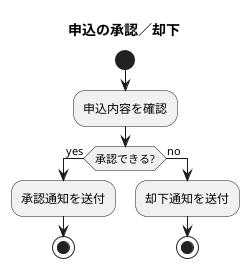
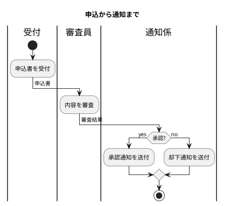

# Process diagram (business flow) / プロセス図（Process：業務フロー）

← [Back to the manual top](index.md) / [マニュアルのトップに戻る](index.md)

A model type for reviewing business flows and procedures. It does not distinguish BPMN from activity diagrams; it handles a **subset of PlantUML activity** narrowed to the part the two have in common. From the flow of processing, you can extract and survey **scenarios (the basis for E2E / UAT tests)** and the **roles, artifacts, events, and externals** that appear.

業務フロー・手続きをレビューするためのモデル型です。BPMN とアクティビティ図を区別せず、
両者の共通部分に絞った **PlantUML activity のサブセット** を扱います。
処理の流れから **シナリオ（E2E / UAT テストの土台）** や、登場する **ロール・成果物・イベント・外部**
を抽出して俯瞰できます。

This page assumes the common operations (screen layout, chat, markers, saving, etc.). If you have not read them yet, read the [top page](index.md) first.

このページは共通操作（画面構成・チャット・マーカー・保存など）を前提にしています。
まだの場合は先に [トップページ](index.md) を読んでください。

---

## What you can do with this type / この型でできること

- Draw the flow of processing (start → each action → branch → end) / 処理の流れ（開始 → 各アクション → 分岐 → 終了）を描く
- Survey who (role / lane) hands off what (artifact) in the flow / 誰が（ロール／レーン）何を受け渡す（成果物）フローかを俯瞰する
- Enumerate the **scenarios** that trace the flow, and use them as the basis for E2E / UAT tests / 流れをたどった **シナリオ** を洗い出し、E2E / UAT テストの土台にする

---

## How to write the source (supported subset) / ソースの書き方（対応サブセット）

In the Source tab, write in the PlantUML activity (activity diagram) subset. A new session starts from a template containing only `start`. The main syntax you will use is as follows.

Source タブに、PlantUML の activity（アクティビティ図）サブセットで記述します。
新しいセッションは `start` だけを含む雛形から始まります。主に使う構文は次のとおりです。

- `start` … start, `stop` … end / `start` … 開始、`stop` … 終了
- `:アクション;` … one process (an action) / `:アクション;` … 1 つの処理（アクション）
- `if (条件?) then (yes) ... else (no) ... endif` … branch / `if (条件?) then (yes) ... else (no) ... endif` … 分岐
- `|ロール名|` … swimlane (who is responsible for that action) / `|ロール名|` … スイムレーン（そのアクションの担当）
- `-> 成果物;` … the artifact handed off next (data / document) / `-> 成果物;` … 次に受け渡される成果物（データ・ドキュメント）
- `title ...` … the diagram title / `title ...` … 図のタイトル

Not supported: nested fork, nested partition, `while` / `repeat` loops, `elseif`, `detach` / `kill`, legacy syntax, and so on (limited to the common part needed for review).

対応しないもの：入れ子の fork、ネストした partition、`while` / `repeat` ループ、`elseif`、
`detach` / `kill`、旧記法など（レビュー目的の共通部分に限定しています）。

### Example (a simple branch) / 例（単純な分岐）



### Example (handoff across lanes) / 例（レーンをまたぐ受け渡し）



The exact syntax is given in full in the **"Grammar definition (EBNF)"** below.

正確な構文は、下記の **「文法定義（EBNF）」** に全文を載せています。

---

## Grammar definition (EBNF) / 文法定義（EBNF）

This is the **formal definition** of the syntax ModelLogue accepts for this model type. Any syntax not listed here is rejected as a line-numbered syntax error. The full text is reproduced below as-is, so you can copy and use it.

このモデル型で ModelLogue が受け付ける構文の**正式な定義**です。ここに載っていない構文は、行番号付きの構文エラーとして拒否されます。全文は下記にそのまま掲載しているので、コピーして使えます。

**How to use it**: Paste this definition block straight to the AI and tell it "generate PlantUML following this grammar," and you are more likely to get output that stays within the subset. ModelLogue itself uses the same definition when instructing the AI.

**使い方**: この定義ブロックをそのまま AI に貼り付け、「この文法に従って PlantUML を生成して」と伝えると、サブセットから外れない出力を得やすくなります。ModelLogue 自身も、同じ定義を AI への指示に使っています。

```ebnf
(* ModelLogue PlantUML Process Diagram Subset Grammar *)
(* Version: 1.2.2                                       *)
(* Reference: ADR-009 (minimal-subset guardrails),       *)
(*            ADR-012 (model-type plugin architecture),  *)
(*            §3.15 Requirements_Specification.md        *)
(*                                                       *)
(* Changelog:                                            *)
(*   1.0 (2026-04-24): initial draft                     *)
(*   1.1 (2026-04-24): 9-point refinement                *)
(*     - partition can contain lane declarations (multi- *)
(*       actor sub-processes are realistic)              *)
(*     - task labels may span multiple lines             *)
(*     - partition accepts optional color tag            *)
(*     - `elseif` / `else if` explicitly rejected        *)
(*     - accept-and-ignore list codified: skinparam /    *)
(*       header / footer / legend / note / hide-empty /  *)
(*       !procedure / !include                           *)
(*     - arrow label placement rules spelled out         *)
(*     - start cardinality = exactly once; stop/end      *)
(*       cardinality = one or more                       *)
(*   1.2 (2026-04-25): keyword spelling variants         *)
(*     - `endif` and `end if` (with internal whitespace) *)
(*       are both accepted forms — PlantUML treats them  *)
(*       as synonyms and Gemini-class LLMs frequently    *)
(*       generate the two-word form because that's what  *)
(*       most public examples use                        *)
(*     - `endwhile` and `end while` symmetrically both   *)
(*       reject (loops still aren't in the subset, but   *)
(*       both spellings are caught now)                  *)
(*   1.2.1 (2026-04-28): TOLERANCES section introduced   *)
(*     This file now distinguishes "spec" (above the     *)
(*     TOLERANCES marker — strict; never relaxed to chase *)
(*     AI drift) from "tolerances" (a parser-only         *)
(*     forgiveness layer for common deviating inputs the  *)
(*     parser silently absorbs without erroring). T-1     *)
(*     was the first such tolerance; see §TOLERANCES.    *)
(*   1.2.2 (2026-04-29): swimlane ordering tightened     *)
(*     The first `lane_declaration` of a diagram, if any, *)
(*     MUST appear BEFORE `start`. PlantUML's activity    *)
(*     engine hard-rejects a swimlane introduced after    *)
(*     `start` has fired ("This swimlane must be defined  *)
(*     at the start of the diagram"). v1.2.1 left this    *)
(*     under-specified — `lane_declaration` was allowed   *)
(*     in both prelude and body, which let the parser     *)
(*     accept input PlantUML refused to render and the    *)
(*     diagram pane stayed at the seed image. Subsequent  *)
(*     lane declarations during the body (LANE CHANGES)   *)
(*     remain valid; only the FIRST-EVER one is now       *)
(*     constrained.                                       *)
(*                                                       *)
(* Purpose: Define the ONLY syntax ModelLogue accepts    *)
(* for the `process` model type (UR-015, v7.6). Any      *)
(* construct not listed here is rejected with a line-    *)
(* numbered syntax error, EXCEPT the explicitly listed   *)
(* accept-and-ignore decorators (§ "Ignored decorators") *)
(* which are tolerated so pasted real-world PlantUML     *)
(* does not fail the parser for purely cosmetic reasons. *)
(*                                                       *)
(* Design principle: This is a REVIEW-ORIENTED SUBSET of *)
(* PlantUML's "beta" activity-diagram syntax. We do NOT  *)
(* aim for formal BPMN / UML Activity compliance; we     *)
(* include only what reviewers need to agree on an E2E / *)
(* UAT / system-test plan.                               *)

(* ===== Top-level structure ===== *)

diagram          = "@startuml" , newline ,
                   { prelude_line , newline } ,
                   start_node , newline ,
                   { body_line , newline } ,
                   "@enduml" ;

(* The prelude accepts decorative directives that come *)
(* BEFORE `start`. Lane declarations may also appear   *)
(* here — the lane active when `start` fires becomes   *)
(* the default lane for subsequent nodes.              *)
(*                                                       *)
(* Swimlane-ordering rule (v1.2.2):                      *)
(*   If the diagram uses swimlanes AT ALL, the FIRST     *)
(*   `lane_declaration` MUST appear in the prelude       *)
(*   (i.e. before `start`). PlantUML's activity engine   *)
(*   rejects an after-start first-ever swimlane with     *)
(*   "This swimlane must be defined at the start of the *)
(*   diagram." Subsequent lane declarations in the body  *)
(*   are LANE CHANGES and remain valid.                  *)

prelude_line     = empty_line
                 | comment
                 | ignored_decorator
                 | lane_declaration ;

(* The body accepts all forms that can appear AFTER     *)
(* `start`. Arrow labels are body-only (they cannot     *)
(* appear before `start`).                              *)
(*                                                       *)
(* `lane_change` is structurally identical to a          *)
(* `lane_declaration` token, but the parser only accepts *)
(* it here when at least one lane was already declared   *)
(* in the prelude. A first-ever `|...|` token in the     *)
(* body is rejected with a parse error pointing at the   *)
(* PlantUML constraint above (v1.2.2).                   *)

body_line        = empty_line
                 | comment
                 | ignored_decorator
                 | lane_change
                 | partition_open
                 | partition_close
                 | stop_node
                 | task
                 | arrow_label
                 | if_construct
                 | fork_construct ;

lane_change      = lane_declaration ;

empty_line       = { whitespace } ;
comment          = "'" , { any_char } ;

(* ===== Ignored decorators (accept-and-forget) ===== *)
(*                                                       *)
(* These carry no model information but are common in    *)
(* pasted real-world PlantUML. Accept and skip during    *)
(* parsing; they do NOT reject and do NOT contribute to  *)
(* ProcessModel.                                         *)

ignored_decorator
                 = title_line
                 | skinparam_line
                 | header_block
                 | footer_block
                 | legend_block
                 | note_block
                 | hide_directive
                 | include_directive
                 | procedure_block ;

title_line       = "title" , whitespace , { any_char } ;
skinparam_line   = "skinparam" , whitespace , { any_char } ;

(*                                                       *)
(*  header / footer / legend / note come in both single- *)
(*  line and block forms. Block forms consume lines up   *)
(*  to their matching terminator.                        *)

header_block     = "header" , ( single_line_tail
                              | block_body , "endheader" ) ;
footer_block     = "footer" , ( single_line_tail
                              | block_body , "endfooter" ) ;
legend_block     = "legend" , ( single_line_tail
                              | block_body , "end legend" ) ;

note_block       = "note" , ( note_single | note_multi ) ;
note_single      = whitespace , note_position , [ " of " , identifier ] ,
                   " : " , { any_char } ;
note_multi       = whitespace , note_position , [ " of " , identifier ] ,
                   newline , block_body , "end note" ;
note_position    = "left" | "right" | "top" | "bottom" ;

(* ===== Note-embedded external references (SR-125) ===== *)
(*                                                       *)
(*  Notes are accepted and ignored at parse time (above) *)
(*  for the purpose of graph construction. A post-parse  *)
(*  pass extracts external system / repository           *)
(*  references from note content matching this pattern:  *)
(*                                                       *)
(*    ^(\*\*外部:\*\*|\*\*External:\*\*) \s* <name>       *)
(*                                                       *)
(*  e.g.                                                  *)
(*    :外部からの問合せを受信;                              *)
(*    note right                                          *)
(*    **外部:** 提携先 API                                  *)
(*    end note                                            *)
(*                                                       *)
(*  IMPORTANT — when to use this pattern:                *)
(*  ModelLogue is a system-design review tool. The       *)
(*  systems THE PROJECT IS DESIGNING / MODIFYING are     *)
(*  first-class participants and naturally appear as     *)
(*  swim lanes alongside human roles. Use the            *)
(*  `**外部:**` note only for systems / repositories     *)
(*  EXPLICITLY MARKED as out-of-project-scope by the     *)
(*  requirements text or user message (keywords:         *)
(*  外部 / external / 他社の / 既存の-で-触らない).         *)
(*  The default disposition for any system is "lane",    *)
(*  not "note".                                           *)
(*                                                       *)
(*  The matched lines register (task → external) tuples  *)
(*  that drive the Externals tab (SR-125). Non-matching  *)
(*  lines remain as free annotation and are visible in   *)
(*  the rendered SVG but do not appear in the tab.       *)
(*                                                       *)
(*  PlantUML has no freely-placed inline object; notes   *)
(*  are used because they are visually distinct (yellow  *)
(*  dog-eared box) from tasks AND carry no inter-note    *)
(*  ordering, matching the semantics of "this task       *)
(*  touches these externals, which have no order amongst *)
(*  themselves".                                          *)

hide_directive   = "hide" , whitespace , { any_char } ;
include_directive= ( "!include" | "!import" ) , whitespace , { any_char } ;

procedure_block  = "!procedure" , block_body , "!endprocedure" ;

single_line_tail = whitespace , { any_char } ;
block_body       = { any_line , newline } ;
any_line         = { any_char } ;

(* ===== Nodes ===== *)

(*                                                       *)
(*  start       — exactly one per diagram                *)
(*  stop / end  — one or more; `end` is a synonym        *)
(*                                                       *)
(*  :label;                                               *)
(*  :label;<<stereotype>>                                *)
(*                                                       *)
(*  Recognised stereotypes (carry Events-tab semantics): *)
(*    timer   / message   / error                        *)
(*  Any other stereotype is accepted as a free label but *)
(*  the task is treated as a plain task.                 *)
(*                                                       *)
(*  A task label may span multiple lines; parser         *)
(*  concatenates the text up to the first `;` verbatim.  *)

start_node       = "start" ;
stop_node        = "stop" | "end" ;

task             = ":" , task_label , ";" ,
                   [ stereotype ] ;

(*                                                       *)
(*  task_label is any character sequence until the first *)
(*  unescaped `;`. Newlines WITHIN the label are allowed *)
(*  and preserved in the model as `\n`.                  *)

task_label       = { any_char_except_semicolon | newline } ;
stereotype       = "<<" , stereotype_name , ">>" ;
stereotype_name  = identifier ;

(* ===== Arrow labels (artifact / 伝票 names) ===== *)

(*                                                       *)
(*  :task1;                                               *)
(*  -> 申込書;                                             *)
(*  :task2;                                               *)
(*                                                       *)
(*  Semantics: `-> label;` labels the SUBSEQUENT edge —  *)
(*  the arrow from the previous node to the next node.   *)
(*                                                       *)
(*  Valid placements (must have a successor node):       *)
(*    - directly after `start`                           *)
(*    - directly after a task                            *)
(*    - directly after `endif` / `end fork`              *)
(*    - inside an if / else branch, after `then (...)` / *)
(*      `else (...)` and before the first task           *)
(*    - inside a fork branch, after `fork` /             *)
(*      `fork again` and before the first task           *)
(*                                                       *)
(*  Invalid placements (parse error):                    *)
(*    - before `start` (no preceding node)               *)
(*    - directly after `stop` / `end` (no successor)     *)
(*    - immediately before `endif` / `else` /            *)
(*      `end fork` (no successor before the closer)      *)

arrow_label      = "->" , whitespace ,
                   artifact_label , ";" ;

artifact_label   = { any_char_except_semicolon } ;

(* ===== Branches ===== *)

(*                                                       *)
(*  if (条件) then (yes)                                   *)
(*    :task-in-yes;                                       *)
(*  else (no)                                             *)
(*    :task-in-no;                                        *)
(*  endif                                                 *)
(*                                                       *)
(*  The `then (yes)` and `else (no)` branch-label         *)
(*  annotations are optional in PlantUML, but ModelLogue  *)
(*  REQUIRES both so Scenarios rows carry a readable      *)
(*  branch-taken value.                                   *)
(*                                                       *)
(*  `elseif` / `else if` is REJECTED — the user should    *)
(*  rewrite as nested if for review clarity.              *)
(*                                                       *)
(*  A branch body may contain any body_line (task,        *)
(*  arrow label, comment, nested if, fork, partition,     *)
(*  lane change, stop/end). Multiple `stop` in both       *)
(*  branches is fine (no merge node required).            *)

if_construct     = if_head , newline ,
                   { body_line , newline } ,
                   else_clause , newline ,
                   { body_line , newline } ,
                   endif_keyword ;

if_head          = "if" , whitespace ,
                   "(" , condition , ")" , whitespace ,
                   "then" , whitespace ,
                   "(" , branch_label , ")" ;

else_clause      = "else" , whitespace ,
                   "(" , branch_label , ")" ;

(* PlantUML accepts both `endif` and `end if` as synonyms.       *)
(* `end if` may have any whitespace between the two words        *)
(* (single space is conventional; tab also works). v1.2.         *)
endif_keyword    = "endif" | "end" , whitespace , "if" ;

condition        = { any_char_except_close_paren } ;
branch_label     = { any_char_except_close_paren } ;

(* ===== Parallel regions (fork / join) ===== *)

(*                                                       *)
(*  fork                                                  *)
(*    :branch-a-task;                                     *)
(*  fork again                                            *)
(*    :branch-b-task;                                     *)
(*  end fork                                              *)
(*                                                       *)
(*  Rules:                                               *)
(*    - nested fork inside fork is REJECTED              *)
(*    - fork branches may contain if, partition, lane    *)
(*      change, stop/end                                 *)
(*    - `start` inside a fork branch is a parse error    *)
(*      (only the top-level diagram has a start)         *)

fork_construct   = "fork" , newline ,
                   fork_branch ,
                   { "fork again" , newline ,
                     fork_branch } ,
                   "end fork" ;

fork_branch      = { fork_branch_line , newline } ;

fork_branch_line = empty_line
                 | comment
                 | ignored_decorator
                 | stop_node
                 | task
                 | arrow_label
                 | if_construct
                 | partition_open
                 | partition_close
                 | lane_declaration ;

(* ===== Swim lanes ===== *)

(*                                                       *)
(*  |Actor Name|                                          *)
(*                                                       *)
(*  Scope: stateful. A lane declaration sets the current *)
(*  lane for every subsequent node until the next lane   *)
(*  declaration. The setting persists across if / fork / *)
(*  partition block boundaries, matching PlantUML.       *)
(*                                                       *)
(*  Default lane when no `|...|` precedes the first node: *)
(*  the literal string `(default)`.                      *)
(*                                                       *)
(*  Lane declarations ARE allowed inside partition — a   *)
(*  sub-process can legitimately be a multi-actor        *)
(*  collaboration. The partition box will span multiple  *)
(*  lane columns in the rendered SVG.                    *)
(*                                                       *)
(*  ORDERING (v1.2.2): if the diagram uses swimlanes at  *)
(*  all, the FIRST `|...|` declaration must appear in    *)
(*  the prelude (before `start`). PlantUML rejects an    *)
(*  after-start first lane outright. Lane CHANGES        *)
(*  during the body (subsequent `|...|` lines after the  *)
(*  prelude one) are valid and common.                   *)

lane_declaration = "|" , lane_name , "|" ;
lane_name        = { any_char_except_pipe } ;

(* ===== Partitions (sub-process grouping, 1 level only) ===== *)

(*                                                       *)
(*  partition "与信チェック" {                            *)
(*    :スコア算出;                                         *)
(*    :ブラックリスト照会;                                 *)
(*    :与信判定;                                           *)
(*  }                                                     *)
(*                                                       *)
(*  Optional color tag:                                  *)
(*    partition #LightGray "名前" { ... }                *)
(*                                                       *)
(*  Nested partitions are REJECTED.                      *)
(*                                                       *)
(*  Lane declarations ARE allowed inside (see above).    *)

partition_open   = "partition" , whitespace ,
                   [ color_tag , whitespace ] ,
                   '"' , partition_name , '"' ,
                   whitespace , "{" ;

partition_close  = "}" ;

color_tag        = "#" , color_name ;
color_name       = identifier ;
partition_name   = { any_char_except_quote } ;

(* ===== Terminals ===== *)

identifier       = letter , { letter | digit | "_" | "-" } ;
letter           = "a" | "b" | "..." | "z" | "A" | "..." | "Z" ;
digit            = "0" | "1" | "..." | "9" ;

whitespace       = " " | "\t" ;
newline          = ?NEWLINE? ;

any_char                     = ?any Unicode scalar except newline? ;
any_char_except_semicolon    = ?any Unicode scalar except ";" or newline? ;
any_char_except_close_paren  = ?any Unicode scalar except ")" or newline? ;
any_char_except_pipe         = ?any Unicode scalar except "|" or newline? ;
any_char_except_quote        = ?any Unicode scalar except "\"" or newline? ;

(* ===== NOT SUPPORTED (rejected as parse errors) ===== *)
(*                                                       *)
(*   - Nested `fork` inside `fork`                       *)
(*   - Nested `partition` inside `partition`             *)
(*   - `while` / `endwhile` / `end while` / `repeat` /   *)
(*     `repeat while` (loops are out of scope; both      *)
(*     spelling variants are rejected for symmetry with  *)
(*     `endif` / `end if` acceptance)                    *)
(*   - `detach` / `kill`                                 *)
(*   - `elseif` / `else if` (rewrite as nested if)       *)
(*   - Dot-notation entry / exit points                  *)
(*   - Legacy activity syntax (`(*)` start, `-->` plain  *)
(*     rectangle arrows)                                 *)
(*   - BPMN collaboration / pool-to-pool message flow    *)
(*   - `start` appearing more than once, or inside any   *)
(*     nested block                                      *)
(*   - `arrow_label` with no successor node              *)
(*   - First-ever `lane_declaration` appearing AFTER     *)
(*     `start` (PlantUML hard-rejects; v1.2.2)           *)
(*                                                       *)
(* Unrecognised `<<stereotype>>` names are NOT rejected; *)
(* they are accepted as free labels but do not surface   *)
(* in the Events tab (SR-121) — only timer / message /   *)
(* error do.                                             *)

```

## Dialogue with the AI / AI との対話

- In process diagrams, the exchange with the AI is in **PlantUML** (the same method as state machines; not CSV like requirement diagrams). / プロセス図では、AI との受け渡しは **PlantUML**（状態遷移図と同じ方式。要求図のような CSV ではありません）。
- To generate from requirements, write the requirement text in the Requirements tab and press **Generate Model**.
  The AI returns activity-diagram source within the subset in a ```` ```plantuml ```` block. / 要求から生成するときは Requirements タブに要求文を書いて **Generate Model**。
  AI はサブセット内のアクティビティ図ソースを ```` ```plantuml ```` ブロックで返します。
- During review, if you instruct it with something like "add an out-of-stock branch," the AI proposes revised source. / レビュー中は「在庫切れの分岐を追加して」等と指示すると、AI が修正後のソースを提案します。

### Applying proposals (automatic) and automatic markers / 提案の反映（自動）と自動マーカー

- Process-diagram proposals are **applied automatically** (there is no proposal view with an Apply button like state machines have). / プロセス図の提案は **自動で反映** されます（状態遷移図のような Apply ボタン付きの提案ビューは出ません）。
- Changed parts are shown on the diagram with **automatic markers**: **added = solid green**, **changed = dashed orange**. / 変更箇所は図の上に **自動マーカー** で示されます。**追加＝緑の実線**、**変更＝橙の破線**。
- An apply can be reverted with **↶ Undo / ↷ Redo** on the diagram toolbar. / 反映は図ツールバーの **↶ Undo / ↷ Redo** で戻せます。

---

## Analysis tabs / 分析タブ

After the shared Requirements and Source tabs, this type shows the following tabs.

Requirements・Source の共通タブに続いて、この型では次のタブが並びます。

### Scenarios / Scenarios（シナリオ）

A list of the paths that trace the flow from start to end. It becomes the **basis for E2E tests and UAT (acceptance test) cases**. By enumerating the paths taken at each branch, you can check for gaps in test coverage.

開始から終了までの流れをたどった経路の一覧です。**E2E テストや UAT（受け入れテスト）のケースの土台**
になります。分岐ごとに通る経路を洗い出し、テスト観点の抜けを確認できます。

### Events / Events（イベント）

A list of the events (triggers and occurrences) that appear in the flow.

フロー中に現れるイベント（トリガーや発生事象）の一覧です。

### Roles / Roles（ロール）

A list of the people and roles that appear as swimlanes (`|ロール名|`). Use it to survey the division of responsibility.

スイムレーン（`|ロール名|`）として登場する担当者・役割の一覧です。責任分担の俯瞰に使います。

### Artifacts / Artifacts（成果物）

A list of the artifacts handed off in the flow (`-> 成果物;`: data, documents, etc.).

フローで受け渡される成果物（`-> 成果物;`：データ・ドキュメントなど）の一覧です。

### Externals / Externals（外部）

A list of the external references the process involves (external systems, external stakeholders, etc.).

プロセスが関わる外部の参照（外部システム・外部関係者など）の一覧です。

---

## How to proceed with a review of this type (a guide) / この型のレビューの進め方（目安）

1. Write requirements in Requirements and press **Generate Model**, or write directly in Source. / Requirements に要求を書き **Generate Model**、または Source に直接記述。
2. In **Roles / Artifacts**, check that the responsibilities and handoffs are appropriate. / **Roles / Artifacts** で、担当と受け渡しが妥当かを確認。
3. In **Scenarios**, enumerate the paths and check for gaps from an E2E / UAT perspective. / **Scenarios** で経路を洗い出し、E2E / UAT の観点として抜けがないかを確認。
4. Instruct the AI in chat to add or fix branches → applied automatically (check the diff with the green / orange markers). / 分岐追加・修正をチャットで AI に指示 → 自動反映（緑／橙のマーカーで差分を確認）。
5. Draw markers on the parts you are concerned about. / 気になる箇所にマーカーを描く。
6. In **Save & finish**, choose a conclusion and save the evidence. / **Save & finish** で結論を選んで証跡を保存。

---

← [Back to the manual top](index.md) ｜ Other types: [State machine](state-machine.md) / [Requirement](requirement.md)　／　[マニュアルのトップに戻る](index.md) ｜ 他の型：[状態遷移図](state-machine.md) ／ [要求図](requirement.md)
