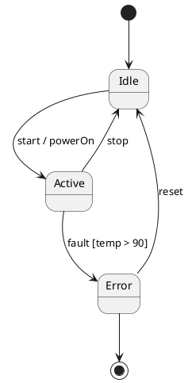

# 状態遷移図（State machine）

← [マニュアルのトップに戻る](index.md)

状態と遷移をレビューするためのモデル型です。UML 風の状態遷移図を PlantUML のサブセットで表現し、
**遷移表（マトリクス）** と **N-switch カバレッジのテストケース** を自動生成します。

このページは共通操作（画面構成・チャット・マーカー・保存など）を前提にしています。
まだの場合は先に [トップページ](index.md) を読んでください。

---

## この型でできること

- 状態・遷移・イベント・ガード・アクションのモデルを描く
- 抜けや不整合を **遷移表** で俯瞰する
- **N-switch テスト**（0/1/2-switch と不正遷移）でテスト観点を洗い出す

---

## ソースの書き方（対応サブセット）

Source タブに、PlantUML の状態図サブセットで記述します。対応するのは次の範囲です。

- 状態と遷移、初期擬似状態 `[*] -->`、終了擬似状態 `--> [*]`、状態の別名
- **イベント / ガード / アクション付きの遷移**（`遷移 : イベント [ガード] / アクション`）
- **1 階層の複合状態**（`state X { ... }`）と、その内部の初期遷移
- 複合状態を起点にしたグループ脱出遷移、複合状態を終点にした進入遷移

対応しない主なもの：入れ子の入れ子、直交領域、ヒストリ擬似状態、ドット記法、entry/exit point、
スタイル・色・ノート。

### 例



正確な構文は、下記の **「文法定義（EBNF）」** に全文を載せています
（ヘッダーの **「Download grammar」** でも同じものをダウンロードできます）。

---

## 文法定義（EBNF）

このモデル型で ModelLogue が受け付ける構文の**正式な定義**です。ここに載っていない構文は、行番号付きの構文エラーとして拒否されます。正本は `src/grammars/stateDiagram.ebnf` にあります。

**使い方**: この定義ブロックをそのまま AI に貼り付け、「この文法に従って PlantUML を生成して」と伝えると、サブセットから外れない出力を得やすくなります。ModelLogue 自身も、同じ定義を AI への指示に使っています。

```ebnf
(* ModelLogue PlantUML State Diagram Subset Grammar *)
(* Version: 1.1 *)
(* Reference: ADR-009 (one-level composite states only) *)
(*                                                       *)
(* This grammar defines the ONLY syntax that ModelLogue  *)
(* accepts. Any construct not listed here is rejected     *)
(* with a syntax error.                                  *)

(* ===== Top-level structure ===== *)

diagram          = "@startuml" , newline ,
                   { line , newline } ,
                   "@enduml" ;

line             = empty_line
                 | comment
                 | state_alias
                 | composite_state
                 | transition ;

empty_line       = { whitespace } ;

comment          = "'" , { any_char } ;

(* ===== State declarations ===== *)

state_alias      = "state" , whitespace ,
                   '"' , label_text , '"' ,
                   whitespace , "as" , whitespace ,
                   state_id ;

(* ===== Composite states (one level only, no nesting) ===== *)

composite_state  = composite_head , newline ,
                   { composite_line , newline } ,
                   "}" ;

composite_head   = "state" , whitespace ,
                   [ '"' , label_text , '"' , whitespace , "as" , whitespace ] ,
                   state_id , whitespace , "{" ;

composite_line   = empty_line
                 | comment
                 | state_alias
                 | transition ;

(* NOTE: A composite_state CANNOT appear inside another     *)
(*       composite_state. The parser enforces max depth = 1 *)

(* ===== Transitions ===== *)

transition       = state_ref , whitespace , arrow , whitespace , state_ref ,
                   [ whitespace , ":" , whitespace , transition_label ] ;

arrow            = "-->" | "->" ;

state_ref        = state_id | initial_final ;

initial_final    = "[*]" ;

transition_label = event_name ,
                   [ whitespace , "[" , guard_text , "]" ] ,
                   [ whitespace , "/" , whitespace , action_text ] ;

(* ===== Terminal symbols ===== *)

state_id         = id_start , { id_cont } ;

id_start         = letter | "_" | unicode_char ;
id_cont          = letter | digit | "_" | unicode_char ;

event_name       = { any_char_except_bracket_slash } ;
  (* Event name: any text up to the first '[' or '/' *)

guard_text       = { any_char_except_close_bracket } ;
  (* Guard condition: any text inside [ ] *)

action_text      = { any_char } ;
  (* Action: any text after / to end of line *)

label_text       = { any_char_except_double_quote } ;
  (* Display label inside double quotes *)

letter           = "A" | "B" | ... | "Z" | "a" | "b" | ... | "z" ;
digit            = "0" | "1" | ... | "9" ;
unicode_char     = (* any Unicode letter: hiragana, katakana, kanji, etc. *) ;
whitespace       = " " | "\t" ;
newline          = "\n" | "\r\n" ;
any_char         = (* any character except newline *) ;

(* ===== Explicitly NOT supported (ADR-009) ===== *)
(*                                                *)
(* The following PlantUML constructs are rejected  *)
(* with a syntax error if detected:                *)
(*                                                *)
(*   - Nested composite states                    *)
(*       state X { state Y { ... } }              *)
(*                                                *)
(*   - Orthogonal regions                         *)
(*       state X { ... -- ... }                   *)
(*                                                *)
(*   - History pseudo-states                      *)
(*       [H]  [H*]                                *)
(*                                                *)
(*   - Dot-notation direct entry                  *)
(*       X.Y  (in transitions)                    *)
(*                                                *)
(*   - Entry/exit point pseudo-states             *)
(*                                                *)
(*   - Styling, colors, notes                     *)
(*                                                *)
(*   - Inline comments ( ' after code )           *)
(*       Not part of the grammar; stripped before  *)
(*       parsing as a preprocessing step.          *)

(* ===== Worked examples (usage conventions, not grammar) ===== *)
(*                                                              *)
(* The rules above fix the SYNTAX ("what can be written"). The  *)
(* two examples below show the intended USAGE for cases the      *)
(* grammar allows but does not spell out. Follow these habits.  *)
(*                                                              *)
(* [1] A display name that contains parentheses (or spaces)      *)
(*     CANNOT be a state_id (id_start / id_cont exclude them).   *)
(*     Give the state a short, paren-free id via an alias and    *)
(*     keep the readable label — parentheses and all — inside    *)
(*     the quotes. A plain name that is already a valid id needs *)
(*     no alias. Prefer meaningful ids (Japanese is fine) over   *)
(*     opaque ones like S1 / S2.                                *)
(*                                                              *)
(*       @startuml                                              *)
(*       state "計測中（一時停止）" as 計測中_停止               *)
(*       [*] --> 計測中                                         *)
(*       計測中 --> 計測中_停止 : 一時停止                       *)
(*       計測中_停止 --> 計測中 : 再開                           *)
(*       計測中 --> [*] : 完了                                   *)
(*       @enduml                                                *)
(*                                                              *)
(* [2] Two states whose display names read almost the same must *)
(*     still get DISTINCT ids, or transitions become ambiguous. *)
(*     Encode the distinction in the id; show the full name via  *)
(*     an alias.                                                *)
(*                                                              *)
(*       @startuml                                              *)
(*       state "動作中（針進む）" as 針進む                      *)
(*       state "動作中（針停止）" as 針停止                      *)
(*       [*] --> 針停止                                         *)
(*       針停止 --> 針進む : 始動                                *)
(*       針進む --> 針停止 : 停止                                *)
(*       @enduml                                                *)
```

## AI との対話

- 要求から生成するときは、Requirements タブに要求文を書いて **Generate Model** を押します。
  AI はサブセット内の状態図ソースを ```` ```plantuml ```` ブロックで返します。
- レビュー中は、チャットで「Error から復帰する遷移が抜けている」等と指示すると、
  AI が修正後のソースを提案します。

### 提案の反映（Apply）

状態遷移図では、AI の提案は **変更前／変更後の提案ビュー** として表示されます。

- 追加・削除・変更が色分けされた差分で確認できます。
- 内容を確認して **Apply** を押すと、モデルに反映されます。
- ただし **最初のモデル生成**（まだ図が空のとき）は、比較対象がないため提案ビューを出さず、
  そのまま反映されます。
- 反映した変更は、図ツールバーの **↶ Undo / ↷ Redo** で戻せます。

---

## 分析タブ

Requirements・Source の共通タブに続いて、この型では次のタブが並びます。

### State×Event（状態 × イベント）

行に状態、列にイベントを取った遷移表です。各セルは「そのイベントを受けたときの遷移先」を示します。
空のセルは「そのイベントは定義されていない」ことを表し、抜けや取りこぼしの発見に役立ちます。

### State×State（状態 × 状態）

行・列ともに状態を取り、状態間の遷移の有無を俯瞰する表です。到達関係や孤立した状態の把握に使います。

### Test cases（N-switch テストケース）

状態遷移モデルから、カバレッジ基準に沿ったテストケースを自動生成します。

- **カバレッジの選択**
  - **0-switch** … 各遷移を 1 回ずつ通す（遷移網羅）。
  - **1-switch** … 連続する 2 遷移の組み合わせを網羅。
  - **2-switch** … 連続する 3 遷移の組み合わせを網羅。
  - **Invalid** … 定義されていない（禁止された）遷移を試す不正系テスト。
- **表示の切り替え**
  - **Tests** … 検証パターン（テストケース）の一覧。
  - **Scenarios** … シナリオ形式の一覧（Invalid モードにはシナリオはありません）。
- 一覧は **CSV でダウンロード** できます。ファイル名にカバレッジ水準が入ります。

> テストケースは、モデルが最低 1 つの状態を持ち、ソースにパースエラーがないときに生成されます。

---

## この型のレビューの進め方（目安）

1. Requirements に要求を書き **Generate Model**、または Source に直接記述。
2. **State×Event** で、想定するイベントに対して遷移が定義されているかを確認。
3. 抜けや誤りをチャットで AI に指摘 → 提案を **Apply**。
4. **Test cases** でテスト観点（特に Invalid）を洗い出し、必要なら CSV を保存。
5. 気になる箇所にマーカーを描く。
6. **Save & finish** で結論を選んで証跡を保存。

---

← [マニュアルのトップに戻る](index.md) ｜ 他の型：[要求図](requirement.md) ／ [プロセス図](process.md)
