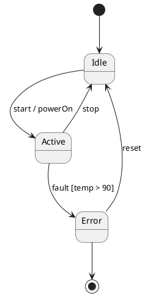

# State machine / 状態遷移図（State machine）

← [Back to the manual top / マニュアルのトップに戻る](index.md)

A model type for reviewing states and transitions. It expresses a UML-style state machine in a PlantUML subset and automatically generates a **transition table (matrix)** and **N-switch coverage test cases**.

状態と遷移をレビューするためのモデル型です。UML 風の状態遷移図を PlantUML のサブセットで表現し、
**遷移表（マトリクス）** と **N-switch カバレッジのテストケース** を自動生成します。

This page assumes the common operations (screen layout, chat, markers, saving, etc.). If you have not read it yet, read the [top page](index.md) first.

このページは共通操作（画面構成・チャット・マーカー・保存など）を前提にしています。
まだの場合は先に [トップページ](index.md) を読んでください。

---

## What you can do with this type / この型でできること

- Draw a model of states, transitions, events, guards, and actions / 状態・遷移・イベント・ガード・アクションのモデルを描く
- Get an overview of gaps and inconsistencies with the **transition table** / 抜けや不整合を **遷移表** で俯瞰する
- Enumerate test perspectives with **N-switch tests** (0/1/2-switch and invalid transitions) / **N-switch テスト**（0/1/2-switch と不正遷移）でテスト観点を洗い出す

---

## How to write the source (supported subset) / ソースの書き方（対応サブセット）

In the **Source** tab, write in the PlantUML state-diagram subset. The supported range is as follows.

Source タブに、PlantUML の状態図サブセットで記述します。対応するのは次の範囲です。

- States and transitions, the initial pseudo-state `[*] -->`, the final pseudo-state `--> [*]`, and state aliases / 状態と遷移、初期擬似状態 `[*] -->`、終了擬似状態 `--> [*]`、状態の別名
- **Transitions with an event / guard / action** (`遷移 : イベント [ガード] / アクション`) / **イベント / ガード / アクション付きの遷移**（`遷移 : イベント [ガード] / アクション`）
- **One-level composite states** (`state X { ... }`) and their internal initial transitions / **1 階層の複合状態**（`state X { ... }`）と、その内部の初期遷移
- Group-exit transitions from a composite state, and entry transitions into a composite state / 複合状態を起点にしたグループ脱出遷移、複合状態を終点にした進入遷移

Main unsupported constructs: nested nesting, orthogonal regions, history pseudo-states, dot notation, entry/exit points, styling, colors, and notes.

対応しない主なもの：入れ子の入れ子、直交領域、ヒストリ擬似状態、ドット記法、entry/exit point、
スタイル・色・ノート。

### Example / 例



The exact syntax is given in full under **“Grammar definition (EBNF)”** below (you can download the same thing via **“Download grammar”** in the header).

正確な構文は、下記の **「文法定義（EBNF）」** に全文を載せています
（ヘッダーの **「Download grammar」** でも同じものをダウンロードできます）。

---

## Grammar definition (EBNF) / 文法定義（EBNF）

This is the **formal definition** of the syntax ModelLogue accepts for this model type. Any construct not listed here is rejected as a syntax error with a line number. The full text is reproduced below as-is, so you can copy and use it (you can also download it via **“Download grammar”** in the header).

このモデル型で ModelLogue が受け付ける構文の**正式な定義**です。ここに載っていない構文は、行番号付きの構文エラーとして拒否されます。全文は下記にそのまま掲載しているので、コピーして使えます（ヘッダーの **「Download grammar」** からもダウンロードできます）。

**How to use it**: paste this definition block straight to the AI and tell it “generate PlantUML following this grammar,” and you are more likely to get output that stays within the subset. ModelLogue itself uses the same definition when instructing the AI.

**使い方**: この定義ブロックをそのまま AI に貼り付け、「この文法に従って PlantUML を生成して」と伝えると、サブセットから外れない出力を得やすくなります。ModelLogue 自身も、同じ定義を AI への指示に使っています。

```ebnf
(* ModelLogue PlantUML State Diagram Subset Grammar *)
(* Version: 1.1 *)
(* Reference: ADR-009 (one-level composite states only) *)
(*                                                       *)
(* This grammar defines the ONLY syntax that ModelLogue  *)
(* accepts. Any construct not listed here is rejected     *)
(* with a syntax error.                                  *)

(* ===== Top-level structure ===== *)

diagram          = "@startuml" , newline ,
                   { line , newline } ,
                   "@enduml" ;

line             = empty_line
                 | comment
                 | state_alias
                 | composite_state
                 | transition ;

empty_line       = { whitespace } ;

comment          = "'" , { any_char } ;

(* ===== State declarations ===== *)

state_alias      = "state" , whitespace ,
                   '"' , label_text , '"' ,
                   whitespace , "as" , whitespace ,
                   state_id ;

(* ===== Composite states (one level only, no nesting) ===== *)

composite_state  = composite_head , newline ,
                   { composite_line , newline } ,
                   "}" ;

composite_head   = "state" , whitespace ,
                   [ '"' , label_text , '"' , whitespace , "as" , whitespace ] ,
                   state_id , whitespace , "{" ;

composite_line   = empty_line
                 | comment
                 | state_alias
                 | transition ;

(* NOTE: A composite_state CANNOT appear inside another     *)
(*       composite_state. The parser enforces max depth = 1 *)

(* ===== Transitions ===== *)

transition       = state_ref , whitespace , arrow , whitespace , state_ref ,
                   [ whitespace , ":" , whitespace , transition_label ] ;

arrow            = "-->" | "->" ;

state_ref        = state_id | initial_final ;

initial_final    = "[*]" ;

transition_label = event_name ,
                   [ whitespace , "[" , guard_text , "]" ] ,
                   [ whitespace , "/" , whitespace , action_text ] ;

(* ===== Terminal symbols ===== *)

state_id         = id_start , { id_cont } ;

id_start         = letter | "_" | unicode_char ;
id_cont          = letter | digit | "_" | unicode_char ;

event_name       = { any_char_except_bracket_slash } ;
  (* Event name: any text up to the first '[' or '/' *)

guard_text       = { any_char_except_close_bracket } ;
  (* Guard condition: any text inside [ ] *)

action_text      = { any_char } ;
  (* Action: any text after / to end of line *)

label_text       = { any_char_except_double_quote } ;
  (* Display label inside double quotes *)

letter           = "A" | "B" | ... | "Z" | "a" | "b" | ... | "z" ;
digit            = "0" | "1" | ... | "9" ;
unicode_char     = (* any Unicode letter: hiragana, katakana, kanji, etc. *) ;
whitespace       = " " | "\t" ;
newline          = "\n" | "\r\n" ;
any_char         = (* any character except newline *) ;

(* ===== Explicitly NOT supported (ADR-009) ===== *)
(*                                                *)
(* The following PlantUML constructs are rejected  *)
(* with a syntax error if detected:                *)
(*                                                *)
(*   - Nested composite states                    *)
(*       state X { state Y { ... } }              *)
(*                                                *)
(*   - Orthogonal regions                         *)
(*       state X { ... -- ... }                   *)
(*                                                *)
(*   - History pseudo-states                      *)
(*       [H]  [H*]                                *)
(*                                                *)
(*   - Dot-notation direct entry                  *)
(*       X.Y  (in transitions)                    *)
(*                                                *)
(*   - Entry/exit point pseudo-states             *)
(*                                                *)
(*   - Styling, colors, notes                     *)
(*                                                *)
(*   - Inline comments ( ' after code )           *)
(*       Not part of the grammar; stripped before  *)
(*       parsing as a preprocessing step.          *)

(* ===== Worked examples (usage conventions, not grammar) ===== *)
(*                                                              *)
(* The rules above fix the SYNTAX ("what can be written"). The  *)
(* two examples below show the intended USAGE for cases the      *)
(* grammar allows but does not spell out. Follow these habits.  *)
(*                                                              *)
(* [1] A display name that contains parentheses (or spaces)      *)
(*     CANNOT be a state_id (id_start / id_cont exclude them).   *)
(*     Give the state a short, paren-free id via an alias and    *)
(*     keep the readable label — parentheses and all — inside    *)
(*     the quotes. A plain name that is already a valid id needs *)
(*     no alias. Prefer meaningful ids (Japanese is fine) over   *)
(*     opaque ones like S1 / S2.                                *)
(*                                                              *)
(*       @startuml                                              *)
(*       state "計測中（一時停止）" as 計測中_停止               *)
(*       [*] --> 計測中                                         *)
(*       計測中 --> 計測中_停止 : 一時停止                       *)
(*       計測中_停止 --> 計測中 : 再開                           *)
(*       計測中 --> [*] : 完了                                   *)
(*       @enduml                                                *)
(*                                                              *)
(* [2] Two states whose display names read almost the same must *)
(*     still get DISTINCT ids, or transitions become ambiguous. *)
(*     Encode the distinction in the id; show the full name via  *)
(*     an alias.                                                *)
(*                                                              *)
(*       @startuml                                              *)
(*       state "動作中（針進む）" as 針進む                      *)
(*       state "動作中（針停止）" as 針停止                      *)
(*       [*] --> 針停止                                         *)
(*       針停止 --> 針進む : 始動                                *)
(*       針進む --> 針停止 : 停止                                *)
(*       @enduml                                                *)
```

## Dialogue with the AI / AI との対話

- When generating from requirements, write the requirement text in the **Requirements** tab and press **Generate Model**. The AI returns the state-diagram source, within the subset, as a ```` ```plantuml ```` block. / 要求から生成するときは、Requirements タブに要求文を書いて **Generate Model** を押します。
  AI はサブセット内の状態図ソースを ```` ```plantuml ```` ブロックで返します。
- During review, if you tell it something like “the transition to recover from Error is missing” in the chat, the AI proposes a revised source. / レビュー中は、チャットで「Error から復帰する遷移が抜けている」等と指示すると、
  AI が修正後のソースを提案します。

### Applying proposals (Apply) / 提案の反映（Apply）

For state machines, an AI proposal is shown as a **before/after proposal view**.

状態遷移図では、AI の提案は **変更前／変更後の提案ビュー** として表示されます。

- You can check additions, deletions, and changes as a color-coded diff. / 追加・削除・変更が色分けされた差分で確認できます。
- Review the content and press **Apply** to reflect it into the model. / 内容を確認して **Apply** を押すと、モデルに反映されます。
- However, the **first model generation** (when the diagram is still empty) has nothing to compare against, so no proposal view is shown and it is applied directly. / ただし **最初のモデル生成**（まだ図が空のとき）は、比較対象がないため提案ビューを出さず、
  そのまま反映されます。
- Applied changes can be reverted with **↶ Undo / ↷ Redo** on the diagram toolbar. / 反映した変更は、図ツールバーの **↶ Undo / ↷ Redo** で戻せます。

---

## Analysis tabs / 分析タブ

After the shared **Requirements** and **Source** tabs, this type adds the following tabs.

Requirements・Source の共通タブに続いて、この型では次のタブが並びます。

### State×Event / State×Event（状態 × イベント）

A transition table with states on the rows and events on the columns. Each cell shows “the destination when that event is received.” An empty cell means “that event is not defined,” which helps you find gaps and omissions.

行に状態、列にイベントを取った遷移表です。各セルは「そのイベントを受けたときの遷移先」を示します。
空のセルは「そのイベントは定義されていない」ことを表し、抜けや取りこぼしの発見に役立ちます。

### State×State / State×State（状態 × 状態）

A table with states on both rows and columns, giving an overview of whether transitions exist between states. Use it to grasp reachability relationships and isolated states.

行・列ともに状態を取り、状態間の遷移の有無を俯瞰する表です。到達関係や孤立した状態の把握に使います。

### Test cases / Test cases（N-switch テストケース）

From the state machine model, it automatically generates test cases according to a coverage criterion.

状態遷移モデルから、カバレッジ基準に沿ったテストケースを自動生成します。

- **Choose the coverage** / **カバレッジの選択**
  - **0-switch** … pass through each transition once (transition coverage). / **0-switch** … 各遷移を 1 回ずつ通す（遷移網羅）。
  - **1-switch** … cover all combinations of two consecutive transitions. / **1-switch** … 連続する 2 遷移の組み合わせを網羅。
  - **2-switch** … cover all combinations of three consecutive transitions. / **2-switch** … 連続する 3 遷移の組み合わせを網羅。
  - **Invalid** … negative tests that try undefined (forbidden) transitions. / **Invalid** … 定義されていない（禁止された）遷移を試す不正系テスト。
- **Switch the display** / **表示の切り替え**
  - **Tests** … a list of verification patterns (test cases). / **Tests** … 検証パターン（テストケース）の一覧。
  - **Scenarios** … a list in scenario form (there are no scenarios in Invalid mode). / **Scenarios** … シナリオ形式の一覧（Invalid モードにはシナリオはありません）。
- The list can be **downloaded as CSV**. The coverage level is included in the file name. / 一覧は **CSV でダウンロード** できます。ファイル名にカバレッジ水準が入ります。

> Test cases are generated when the model has at least one state and the source has no parse errors. / テストケースは、モデルが最低 1 つの状態を持ち、ソースにパースエラーがないときに生成されます。

#### For developers: calling it as an API (demo environment) / 開発者向け：API として呼び出す（デモ環境）

The demo environment exposes the same N-switch generator as an **authentication-free HTTP API** (base URL `https://modellogue.com/nswitch`). No installation is needed; you can generate tests directly from `curl`.

同じ N-switch 生成器を、デモ環境が **認証なしの HTTP API**（ベース URL
`https://modellogue.com/nswitch`）として公開しています。インストール不要で、
`curl` から直接テストを生成できます。

```bash
# 疎通確認
curl https://modellogue.com/nswitch/health
# → {"status": "ok", "version": "0.1.0"}

# PlantUML の状態遷移から 1-switch テストを生成
curl -X POST https://modellogue.com/nswitch/generate \
  -H 'Content-Type: application/json' \
  -d '{"source":"@startuml\n[*] --> A\nA --> B : go\nB --> [*] : done\n@enduml","n":1}'
```

Main parameters: `source` (PlantUML source, required), `n` (the N-switch level `0`/`1`/`2`), `"invalid": true` (add invalid-transition tests), `"format": "csv"` (feed a canonical transition-table CSV instead of PlantUML). The response is returned as JSON (`tests` / `scenarios` / `uncovered` / `scopes`). The demo environment is best-effort, so if you build it into production CI, self-hosting locally is recommended.

主なパラメータ：`source`（PlantUML ソース、必須）、`n`（`0`/`1`/`2` の N-switch 水準）、
`"invalid": true`（不正遷移テストを追加）、`"format": "csv"`（PlantUML の代わりに正準遷移表
CSV を投入）。レスポンスは JSON（`tests` / `scenarios` / `uncovered` / `scopes`）で返ります。
デモ環境はベストエフォートのため、本番 CI に組み込む場合はローカルでの自前ホストを推奨します。

---

## How to run a review of this type (a rough guide) / この型のレビューの進め方（目安）

1. Write requirements in **Requirements** and **Generate Model**, or write directly in **Source**. / Requirements に要求を書き **Generate Model**、または Source に直接記述。
2. In **State×Event**, check whether transitions are defined for the events you expect. / **State×Event** で、想定するイベントに対して遷移が定義されているかを確認。
3. Point out gaps and errors to the AI in the chat → **Apply** the proposal. / 抜けや誤りをチャットで AI に指摘 → 提案を **Apply**。
4. In **Test cases**, enumerate test perspectives (especially Invalid) and save CSV if needed. / **Test cases** でテスト観点（特に Invalid）を洗い出し、必要なら CSV を保存。
5. Draw markers on the parts you are concerned about. / 気になる箇所にマーカーを描く。
6. Choose a conclusion in **Save & finish** and save the evidence. / **Save & finish** で結論を選んで証跡を保存。

---

← [Back to the manual top / マニュアルのトップに戻る](index.md) ｜ Other types / 他の型：[Requirement / 要求図](requirement.md) ／ [Process / プロセス図](process.md)
