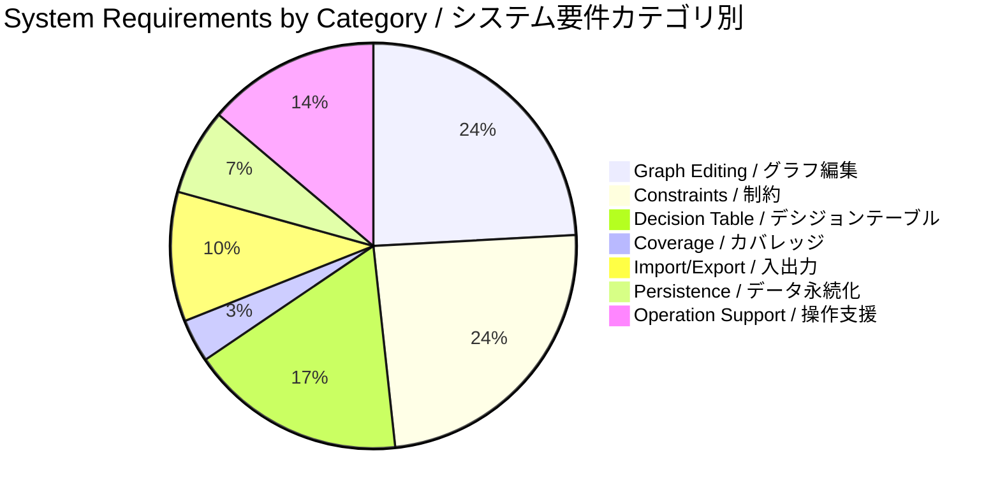

# NeoCEG Requirements Traceability / 要件トレーサビリティ

## 1. Functional Hierarchy Diagram / 機能系統図

```mermaid
flowchart LR
    subgraph UR["User Requirements / ユーザー要求"]
        UR001["UR-001<br/>Review AI-generated graph<br/>AIが生成したグラフをレビューする"]
        UR002["UR-002<br/>Create cause-effect graph<br/>原因結果グラフを作成する"]
        UR003["UR-003<br/>Derive test conditions<br/>テスト条件を導出する"]
        UR004["UR-004<br/>Confirm coverage<br/>網羅状況を確認する"]
        UR005["UR-005<br/>Understand deleted conditions<br/>削除されたテスト条件を把握する"]
        UR006["UR-006<br/>Save and share graph<br/>グラフを保存・共有する"]
    end

    subgraph GE["Graph Editing / グラフ編集"]
        SR001["SR-001<br/>Place node on canvas<br/>ノードをキャンバスに配置する"]
        SR002["SR-002<br/>Edit node properties<br/>ノードのプロパティを編集する"]
        SR003["SR-003<br/>Delete node (cascade)<br/>ノードを削除する（連鎖処理）"]
        SR004["SR-004<br/>Move node<br/>ノードを移動する"]
        SR005["SR-005<br/>Create logical relation<br/>論理関係を作成する"]
        SR006["SR-006<br/>Edit logical relation<br/>論理関係を編集する"]
        SR007["SR-007<br/>Delete logical relation<br/>論理関係を削除する"]
    end

    subgraph CN["Constraints / 制約"]
        SR010["SR-010<br/>ONE: Exactly one true<br/>ONE制約：1つだけ真"]
        SR011["SR-011<br/>EXCL: Not simultaneous<br/>EXCL制約：同時に真にならない"]
        SR012["SR-012<br/>INCL: At least one true<br/>INCL制約：少なくとも1つ真"]
        SR013["SR-013<br/>REQ: A implies B<br/>REQ制約：A→B"]
        SR014["SR-014<br/>MASK: Make indeterminate<br/>MASK制約：不定にする"]
        SR015["SR-015<br/>Edit/delete constraint<br/>制約を編集・削除する"]
        SR016["SR-016<br/>Detect contradiction<br/>制約矛盾を検出する"]
    end

    subgraph DT["Decision Table / デシジョンテーブル"]
        SR020["SR-020<br/>Generate decision table<br/>デシジョンテーブルを生成する"]
        SR021["SR-021<br/>Display values (T/F/M/I)<br/>テーブル値を表示する"]
        SR022["SR-022<br/>Switch display mode<br/>表示モードを切り替える"]
        SR023["SR-023<br/>Calculate indeterminate (I)<br/>不確定値を正しく計算する"]
        SR024["SR-024<br/>Trace result causes<br/>計算結果の原因をトレースする"]
    end

    subgraph CV["Coverage / カバレッジ"]
        SR030["SR-030<br/>Display coverage table<br/>カバレッジ表を表示する"]
    end

    subgraph IE["Import/Export / 入出力"]
        SR040["SR-040<br/>Import DSL<br/>DSLをインポートする"]
        SR041["SR-041<br/>Export DSL<br/>DSLをエクスポートする"]
        SR042["SR-042<br/>Export decision table<br/>デシジョンテーブルをエクスポートする"]
    end

    subgraph PS["Persistence / データ永続化"]
        SR050["SR-050<br/>Save to local storage<br/>ローカルストレージに保存する"]
        SR051["SR-051<br/>Save/load as file<br/>ファイルとして保存・読込する"]
    end

    subgraph OP["Operation Support / 操作支援"]
        SR060["SR-060<br/>Undo/redo operations<br/>操作を取り消し・やり直しする"]
        SR061["SR-061<br/>Select elements<br/>要素を選択する"]
        SR062["SR-062<br/>Zoom/pan canvas<br/>キャンバスをズーム・パンする"]
        SR063["SR-063<br/>Auto-layout nodes<br/>ノードを自動レイアウトする"]
    end

    %% UR-001: Review AI-generated graph
    UR001 --> SR040
    UR001 --> SR063

    %% UR-002: Create cause-effect graph
    UR002 --> SR001
    UR002 --> SR002
    UR002 --> SR003
    UR002 --> SR004
    UR002 --> SR005
    UR002 --> SR006
    UR002 --> SR007
    UR002 --> SR010
    UR002 --> SR011
    UR002 --> SR012
    UR002 --> SR013
    UR002 --> SR014
    UR002 --> SR015
    UR002 --> SR016
    UR002 --> SR060
    UR002 --> SR061
    UR002 --> SR062
    UR002 --> SR063

    %% UR-003: Derive test conditions
    UR003 --> SR016
    UR003 --> SR020
    UR003 --> SR021
    UR003 --> SR023
    UR003 --> SR024

    %% UR-004: Confirm coverage
    UR004 --> SR024
    UR004 --> SR030

    %% UR-005: Understand deleted conditions
    UR005 --> SR022
    UR005 --> SR024

    %% UR-006: Save and share graph
    UR006 --> SR040
    UR006 --> SR041
    UR006 --> SR042
    UR006 --> SR050
    UR006 --> SR051
```

## 2. Traceability Matrix / トレーサビリティマトリクス

| System Requirement / システム要件 | UR-001 | UR-002 | UR-003 | UR-004 | UR-005 | UR-006 |
|----------------------------------|:------:|:------:|:------:|:------:|:------:|:------:|
| **Graph Editing / グラフ編集** |
| SR-001 ノードをキャンバスに配置する |  | x |  |  |  |  |
| SR-002 ノードのプロパティを編集する |  | x |  |  |  |  |
| SR-003 ノードを削除する（連鎖処理） |  | x |  |  |  |  |
| SR-004 ノードを移動する |  | x |  |  |  |  |
| SR-005 論理関係を作成する |  | x |  |  |  |  |
| SR-006 論理関係を編集する |  | x |  |  |  |  |
| SR-007 論理関係を削除する |  | x |  |  |  |  |
| **Constraints / 制約** |
| SR-010 ONE制約を作成する |  | x |  |  |  |  |
| SR-011 EXCL制約を作成する |  | x |  |  |  |  |
| SR-012 INCL制約を作成する |  | x |  |  |  |  |
| SR-013 REQ制約を作成する |  | x |  |  |  |  |
| SR-014 MASK制約を作成する |  | x |  |  |  |  |
| SR-015 制約を編集・削除する |  | x |  |  |  |  |
| SR-016 制約矛盾を検出する |  | x | x |  |  |  |
| **Decision Table / デシジョンテーブル** |
| SR-020 デシジョンテーブルを生成する |  |  | x |  |  |  |
| SR-021 テーブル値を表示する |  |  | x |  |  |  |
| SR-022 表示モードを切り替える |  |  |  |  | x |  |
| SR-023 不確定値を正しく計算する |  |  | x |  |  |  |
| SR-024 計算結果の原因をトレースする |  |  | x | x | x |  |
| **Coverage / カバレッジ** |
| SR-030 カバレッジ表を表示する |  |  |  | x |  |  |
| **Import/Export / 入出力** |
| SR-040 DSLをインポートする | x |  |  |  |  | x |
| SR-041 DSLをエクスポートする |  |  |  |  |  | x |
| SR-042 デシジョンテーブルをエクスポートする |  |  |  |  |  | x |
| **Persistence / データ永続化** |
| SR-050 ローカルストレージに保存する |  |  |  |  |  | x |
| SR-051 ファイルとして保存・読込する |  |  |  |  |  | x |
| **Operation Support / 操作支援** |
| SR-060 操作を取り消し・やり直しする |  | x |  |  |  |  |
| SR-061 要素を選択する |  | x |  |  |  |  |
| SR-062 キャンバスをズーム・パンする |  | x |  |  |  |  |
| SR-063 ノードを自動レイアウトする | x | x |  |  |  |  |

## 3. Category Breakdown / カテゴリ別内訳

## 4. Related Documents / 関連文書

- [User Requirements / ユーザー要求](./requirements/user_requirements.yaml)
- [System Requirements / システム要件](./requirements/system_requirements.yaml)
- [Non-Functional Requirements / 非機能要件](./requirements/nonfunctional_requirements.yaml)
