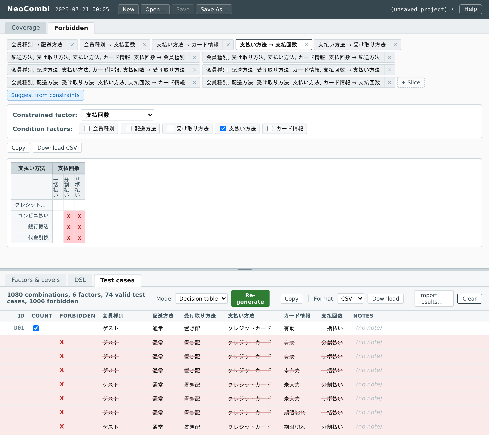
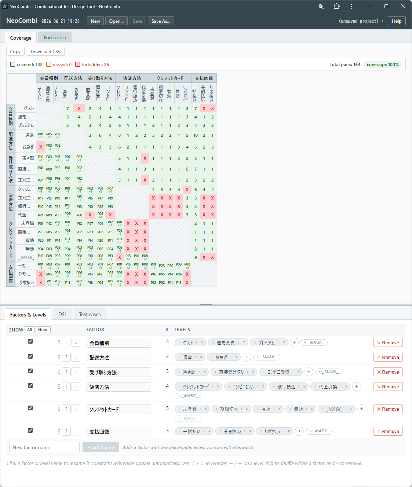

# NeoCombi User Manual / NeoCombi ユーザーマニュアル

**Version**: 1.0 **Date**: 2026-06-20 **DSL Grammar**: 1.0
**Audience**: people *using* NeoCombi to design tests. If you are *deploying*
NeoCombi (running the PICT service, CLI in CI/CD, the API), see the
[Deployment & Operations Guide](Deployment_Guide.md) instead.

**対象読者**：NeoCombi を**使って**テスト設計をする人。NeoCombi を**導入・運用**する
方（PICT サービス／CI/CD の CLI／API）は[導入・運用ガイド](Deployment_Guide.md)へ。

---

## Overview / 概要

NeoCombi helps you design combinatorial tests. You describe a problem as
**factors** and their **levels**, exclude impossible combinations with
**constraints**, and produce test cases — either a compact **pairwise** set or a
full **decision table**. Everything you author is visualized live.

NeoCombi は組み合わせテストの設計ツールです。問題を**因子**と**水準**で表し、
あり得ない組み合わせを**制約**で除外し、コンパクトな**ペアワイズ**集合か、全組み合わせの
**デシジョンテーブル**としてテストケースを作ります。編集内容はその場で可視化されます。

**What you need / 必要なもの**: just a modern browser. Authoring, the forbidden
and coverage views, decision-table generation, and saving/opening files all run
in your browser. (Pairwise generation uses a PICT service that whoever set up
your NeoCombi has already configured — on the public demo it is ready to use.)

モダンブラウザだけ。オーサリング・禁則/総当たりビュー・デシジョンテーブル生成・
ファイル保存/開くはブラウザ内で完結します。（ペアワイズ生成は導入者が用意済みの
PICT サービスを使います。公開デモでは設定済みです。）

> **Privacy / プライバシー.** **Pairwise** generation sends your model (the DSL
> text) over the network to the PICT service — on the public demo, a service the
> operator hosts. **Decision-table** mode sends nothing; it runs entirely in your
> browser. If your model is sensitive, prefer Decision table, or run NeoCombi
> against your own PICT service.
> **ペアワイズ**生成は、あなたのモデル（DSL テキスト）を**ネットワーク越しに PICT
> サービスへ送信**します（公開デモでは運営者がホストするサービス）。**デシジョン
> テーブル**は何も送らず、ブラウザ内で完結します。機微なモデルはデシジョンテーブルを
> 使うか、自分の PICT サービスに向けて実行してください。

---

## Table of Contents / 目次

1. [Introduction / はじめに](#1-introduction--はじめに)
2. [Quick Start / クイックスタート](#2-quick-start--クイックスタート)
3. [Screen Layout / 画面構成](#3-screen-layout--画面構成)
4. [Factors & Levels / 因子と水準](#4-factors--levels--因子と水準)
5. [Writing Constraints / 制約を書く](#5-writing-constraints--制約を書く)
6. [Forbidden View / 禁則ビュー](#6-forbidden-view--禁則ビュー)
7. [Coverage Matrix / 総当たり表](#7-coverage-matrix--総当たり表)
8. [Generating Test Cases / テストケース生成](#8-generating-test-cases--テストケース生成)
9. [Notes, Count Flags & Export / メモ・カウント対象とエクスポート](#9-notes-count-flags--export--メモカウント対象とエクスポート)
10. [Mask Levels / マスク水準](#10-mask-levels--マスク水準)
11. [Saving, Opening & Sharing / 保存・開く・共有](#11-saving-opening--sharing--保存開く共有)
12. [Troubleshooting / トラブルシューティング](#12-troubleshooting--トラブルシューティング)
13. [Appendix: DSL Quick Reference / 付録：DSL クイックリファレンス](#13-appendix-dsl-quick-reference--付録dsl-クイックリファレンス)

---

## 1. Introduction / はじめに

A NeoCombi project is a set of factors, their levels, and the constraints between
them. From that, NeoCombi produces test cases in one of two ways. You choose per
generation, depending on how many factors you have.

NeoCombi のプロジェクトは「因子・水準・制約」の集まりです。そこからテストケースを
2通りで作れます。因子数に応じて生成のたびに選びます。

| | **Pairwise** / ペアワイズ | **Decision table** / デシジョンテーブル |
|---|---|---|
| Produces / 生成物 | a small set covering every pair of levels / 全ペアを覆う小さな集合 | **every** combination of all factors / 全因子の**全組み合わせ** |
| Forbidden rows / 禁止行 | not included / 含まれない | **kept and marked `X`** / 残して `X` 印 |
| Best when / 向く場面 | many factors / 因子が多い | few factors, you want them all / 因子が少なく全部見たい |

There is no AI inside NeoCombi.

NeoCombi に AI は入っていません。

---

## 2. Quick Start / クイックスタート

1. **Open NeoCombi.** On the public demo, you can open a ready-made sample by its
   link, e.g. the *Printer options* sample. From the README:
   *Printer options / Browsers / 50 factors / 100 factors*.
   公開デモでは README のサンプルリンク（Printer options など）からすぐ開けます。
2. **Edit the model.** In the bottom pane, use the **Factors & Levels** table or
   type in the **DSL** tab — they stay in sync. 下ペーンの表か DSL タブで編集（同期）。
3. **Watch the visualizations.** The **Forbidden** and **Coverage** views (top
   pane) update as you type. 上ペーンの Forbidden / Coverage がライブ更新。
4. **Generate.** Open the **Test cases** tab, pick a **Mode**, click **Generate**.
   Test cases タブで Mode を選び Generate。
5. **Add notes, then export.** Fill the **Notes** column, optionally clear a
   case's **Count** flag, then **Copy** or **Download**. Notes を埋め、必要なら
   Count を外し、Copy / Download。
6. **Save.** Use **File → Save** to write a `.ncproj` project (or **Save As…**
   and pick `.ncombi` for the model alone). File → Save で `.ncproj` 保存
   （Save As… で `.ncombi` も選べます）。

---

## 3. Screen Layout / 画面構成

NeoCombi has a **top pane** (live visualizations, read-only) and a **bottom pane**
(where you author and see results), separated by a divider you can drag.

上ペーン（読み取り専用のライブ可視化）と下ペーン（編集・結果）に分かれ、境界は
ドラッグで動かせます。

- **Top pane / 上ペーン**
  - **Coverage** — a cross-tabulation of every factor pair ([§7](#7-coverage-matrix--総当たり表)).
  - **Forbidden** — the combinations your constraints rule out ([§6](#6-forbidden-view--禁則ビュー)).
- **Bottom pane / 下ペーン**
  - **Factors & Levels** — the structured editor ([§4](#4-factors--levels--因子と水準)).
  - **DSL** — the text editor for the whole model ([§5](#5-writing-constraints--制約を書く)).
  - **Test cases** — generation, notes, count flags, export ([§8](#8-generating-test-cases--テストケース生成)).
- **File menu / File メニュー** — New, Open, Save (`.ncombi` model / `.ncproj` project; legacy `.tmodel` opens too).

---

## 4. Factors & Levels / 因子と水準

The **Factors & Levels** tab is a table view of your model. It and the DSL editor
always agree — change one and the other follows.

**Factors & Levels** タブはモデルの表ビューで、DSL エディタと常に一致します。

- **Add, rename, remove** factors and their levels. When you rename a factor or
  level, every reference to it in the constraints is updated for you.
  因子・水準の**追加/改名/削除**。改名すると制約中の参照も自動更新。
- **Reorder** by dragging the handle on a factor row, or by dragging level chips.
  因子行のつまみや水準チップの**ドラッグ**で並べ替え。
- The **Show** checkbox on each factor controls whether it appears in the
  Coverage matrix. 各因子の **Show** で総当たり表の表示対象を絞れます。

NeoCombi treats a factor as **numeric** if all its levels look like numbers, and
**string** otherwise. This affects comparisons (`>`, `<`, …).

すべての水準が数値なら**数値型**、それ以外は**文字列型**として扱われ、比較演算に影響します。

---

## 5. Writing Constraints / 制約を書く

Constraints rule out combinations that can't happen. You write them in the **DSL**
tab using a small language that is a subset of PICT. The editor checks your text as you type
and underlines mistakes.

制約は「起こり得ない組み合わせ」を除外します。**DSL** タブに PICT のサブセットである小さな言語で
書きます。エディタが入力中に検査し、誤りに下線を引きます。

NeoCombi's DSL is a **strict subset of Microsoft PICT's** constraint language
(**Grammar v1.0**). That gives you two practical benefits:

- **It runs directly in PICT.** Whatever is valid here is valid PICT input — you
  can paste it straight into the `pict` command-line tool and it works as-is, and
  you can rely on Microsoft's PICT documentation. No conversion, no lock-in.
- **It is easy to generate with an AI.** The grammar is small and precisely
  defined. You can hand your test problem *together with the EBNF*
  ([§13](#13-appendix-dsl-quick-reference--付録dsl-クイックリファレンス) /
  [DSL_Grammar_Specification.md](DSL_Grammar_Specification.md)) to an AI assistant
  and ask it to write the DSL — then review and refine it in NeoCombi.

NeoCombi の DSL は **Microsoft PICT 制約言語の厳密なサブセット**（**文法 v1.0**）です。
ここから2つの実用的な利点が生まれます：

- **そのまま PICT に直接入力できる。** ここで有効なものは PICT 入力としても有効で、
  `pict` コマンドにそのまま貼って動きます。Microsoft の PICT ドキュメントもそのまま
  参照可能。変換不要・ロックインなし。
- **AI に書かせやすい。** 文法が小さく厳密に定義されているので、テスト対象の説明と
  **EBNF**（[§13](#13-appendix-dsl-quick-reference--付録dsl-クイックリファレンス) /
  [DSL_Grammar_Specification.md](DSL_Grammar_Specification.md)）を AI に渡して DSL を
  生成させ、NeoCombi で確認・修正する、という使い方ができます。

**Declaring factors / 因子の宣言**

```
PaperSize: A4, Letter, Legal
Memory:    4, 8, 16
```

**A constraint / 制約** — `IF … THEN … [ELSE …];`, or an unconditional `… ;`

```
IF [PaperSize] = "Legal" AND [Orientation] = "Landscape" THEN [DuplexMode] = "None";
IF [Memory] < 8 THEN [Disk] < 1000;
[Status] = "Active" OR [Role] <> "Guest";
```

**The pieces / 部品**

| | Examples |
|---|---|
| Refer to a factor / 因子参照 | `[PaperSize]` (always in square brackets / 角括弧) |
| Compare / 比較 | `=` `<>` `>` `>=` `<` `<=` |
| Combine / 論理 | `AND` `OR` `NOT` (upper/lower case both work) |
| A set of values / 集合 | `[OS] IN { "Linux", "FreeBSD" }` |
| Group / グループ化 | `( … )` |

> **A common pitfall / よくある落とし穴.** On the right side of a comparison, and
> inside `IN { }`, a value must be in **quotes** (`"Safari"`) or a **number**
> (`8`). A bare word like `Safari` is rejected — PICT itself rejects it, so
> NeoCombi stops you early. (In the *declaration* line, bare level names are
> fine.)
> 比較の右辺と `IN { }` の中の値は、**クォート**（`"Safari"`）か**数値**（`8`）に
> してください。裸の語はエラーです（PICT 自身が拒否するため、NeoCombi が手前で止めます）。
> **宣言**行の水準名は裸で構いません。

A full operator/grammar reference is in [§13](#13-appendix-dsl-quick-reference--付録dsl-クイックリファレンス).
`LIKE`, sub-models, weights, and negative values are not part of this release and
are flagged as unsupported.

`LIKE`・サブモデル・重み・負値は本リリース対象外で、未対応として表示されます。

---

## 6. Forbidden View / 禁則ビュー

The **Forbidden** view shows, as a grid, which combinations your constraints make
impossible. It is derived from your constraints automatically and updates live.

**Forbidden** ビューは、制約が不可能にする組み合わせを格子で示します。制約から自動で
導出され、ライブ更新します。



*The Forbidden view for the shopping-site example, sliced as 決済方法 (rows) ×
支払回数 (columns). Red **X** cells mark the installment plans コンビニ払い /
銀行振込 / 代金引換 can't use. Below, the decision table keeps those forbidden
rows and flags each with an **X** in the FORBIDDEN column.*
<br>*ショッピングサイト例の禁則ビュー（決済方法＝行 × 支払回数＝列）。赤い **X** は、
コンビニ払い／銀行振込／代金引換 が選べない支払回数を示します。下段のデシジョン
テーブルは禁止行を残し、FORBIDDEN 列に **X** を立てて明示します。*

- Pick **N** and a **slice** — N−1 *condition* factors down the rows, one
  *constrained* factor across the columns. **N** と**スライス**（条件因子 N−1／被制約因子 1）を選択。
- A forbidden cell shows **`X`** (red); an allowed cell is blank.
  禁止セルは赤い **`X`**、許可セルは空白。
- **Suggest from constraints** adds slices worked out from your constraints, so
  you don't have to configure them by hand.
  **Suggest from constraints** で、制約から割り出したスライスを追加。
- Keep several slices as tabs and switch between them; **Copy** / **Download**
  exports the current one.

This view is read-only — it reflects your constraints, you don't edit it directly.

このビューは読み取り専用です（制約を反映するだけ。直接編集はしません）。

---

## 7. Coverage Matrix / 総当たり表

The **Coverage** view cross-tabulates every pair of factors. Before you generate,
it shows just the pair structure; after you generate, it overlays how many test
cases cover each level pair — so you can spot gaps.

**Coverage** ビューは全因子ペアを総当たりします。生成前はペア構造のみ、生成後は各
水準ペアを何件のケースが覆うかを重ねて表示し、抜けを見つけられます。



*The Coverage matrix after generating the shopping-site example. Every factor
pair is cross-tabulated; the summary reads **covered 138 / missed 0 / forbidden
26** — 100% pair coverage. Green cells show how many cases hit each level pair;
red **X** cells are pairs a constraint forbids.*
<br>*生成後の総当たり表（ショッピングサイト例）。全因子ペアを総当たりし、上部に
**covered 138／missed 0／forbidden 26**＝ペア被覆 100% と表示。緑セルは各水準
ペアを覆うケース数、赤い **X** は制約で禁止されたペアです。*

| Cell shows / セル表示 | Meaning / 意味 |
|---|---|
| a number / 数字 | how many test cases cover this pair / そのペアを覆うケース数 |
| `X` | forbidden by a constraint / 制約で禁止 |
| `?` | allowed but not covered — a gap worth checking / 許可だが未被覆（要確認） |
| `·` | nothing generated yet / まだ生成していない |
| `—` | the diagonal (a factor against itself) / 対角（同一因子） |

Use the per-factor **Show** checkboxes to focus on the factors you care about.

---

## 8. Generating Test Cases / テストケース生成

Go to **Test cases**, choose a **Mode**, and click **Generate** (or
**Re-generate**). Each row is one test case.

**Test cases** で **Mode** を選び **Generate / Re-generate**。1 行が 1 ケースです。

**Pairwise mode / ペアワイズ**
A compact set that covers every pair of levels (set the strength with the order
control; 2 = pairwise). Forbidden combinations are left out.
全ペアを覆う小さな集合（強度は order で指定、2＝ペアワイズ）。禁止行は出ません。

**Decision-table mode / デシジョンテーブル**
Lists **every** combination of all factors, in order, with forbidden rows kept and
marked **`X`** in a *Forbidden* column. Because every row is kept, this is meant
for **small** factor sets — NeoCombi refuses to generate more than **4096**
combinations and tells you the count.
全因子の**全組み合わせ**を並べ、禁止行は残して *Forbidden* 列に **`X`**。全行を残すので
**少因子向け**で、**4096** 通りを超えると件数を示して生成を断ります。

Switching mode clears the current table (its rows belong to the previous mode);
just generate again. モードを切り替えると現在の表はクリアされます（再生成してください）。

### 開発者向け：API として呼び出す（デモ環境）/ Call it as an API (demo)

同じ生成器が、デモ環境で **認証なしの HTTP API**（ベース URL
`https://modellogue.com/pict`）として動いています。インストール不要で、DSL を本文に
渡して `curl` から直接生成できます。The same generator is live as a **no-auth HTTP
API** on the demo environment — POST your DSL as the request body, no install needed.

```bash
# 疎通確認 / liveness
curl https://modellogue.com/pict/health
# → {"ok":true,"available":true, ...}

# ペアワイズ（PICT）— order=2、本文=DSL、TSV が返る
printf 'OS: Win, Mac, Linux\nBrowser: Chrome, Firefox, Safari\n' \
  | curl -X POST 'https://modellogue.com/pict/generate?order=2' --data-binary @-

# デシジョンテーブル（内製評価器・PICT 不使用）— 全組み合わせ＋禁止フラグの JSON
printf 'OS: Win, Mac\nBrowser: Chrome, Firefox\n' \
  | curl -X POST 'https://modellogue.com/pict/decision-table' --data-binary @-
```

`order` は強度（`2` ＝ペアワイズ）。デモ環境はレート制限・タイムアウトありのベストエフォート
です。本番 CI に組み込むなら、ローカルでの自前ホスト（`pict-service` コンテナ）を推奨します。

---

## 9. Notes, Count Flags & Export / メモ・カウント対象とエクスポート

**IDs / ID.** Every test case carries a stable, human-readable **ID** — `P01`,
`P02`… for pairwise, `D0001`… for a decision table (zero-padded to the case
count). IDs are assigned at generation, shown in the grid, saved with the
project, and reassigned only when you explicitly re-generate.

各ケースには安定した **ID**（ペアワイズは `P01`…、デシジョンテーブルは `D0001`…）が
付き、生成時に採番され、明示再生成のときだけ振り直されます。

**Notes / メモ.** Click a cell in the **Notes** column and type a memo for that
case — an expected result, a remark, a reference, whatever you need. Notes are
bound to the case by ID and saved in a `.ncproj` project.

**Notes** 列のセルにそのケースのメモ（期待結果・備考・参照など）を入力します。メモは
ID で対応づけられ、`.ncproj` に保存されます。

**Count toward coverage / カウント対象.** Each case has a **Count** checkbox
(default on). The coverage matrix and rate ([§7](#7-coverage-matrix--総当たり表))
count **only** flagged-in cases, so if you clear it (e.g. a case failed, can't be
run, or hasn't run yet) any pair it alone covered shows as *missed*. This turns
"planned" coverage into "achieved" coverage.

各ケースの **Count** チェック（既定オン）を外すと、そのケースは網羅計算から除外され、
そのケースだけが覆っていたペアは「未達」表示になります。「計画網羅」を「達成網羅」に
変えるための仕組みです。

**Import results / 結果の取り込み.** **Import results…** writes back a CSV with
`id`, `count`, and `note` columns (header required; the flag as `true`/`false`),
matching each row to a case by ID. This is how an external execution system feeds
results back. Validation is strict but never destructive or silent:

- **Wrong file** — if the header has no `id` / `count` / `note` columns (e.g. you
  picked a factor-column CSV by mistake), the whole import is **rejected**:
  nothing changes and an error names the required columns.
- **Bad rows** — a row with an unrecognised count, an empty ID, or a duplicate ID
  is **skipped** (for a duplicate, the first wins) and reported with its line and
  reason.
- **Unmatched IDs** — a row whose ID matches no case is skipped and reported (with
  a sample of the IDs); no case is created.
- An empty note cell clears that case's note; overwriting recorded flags / notes
  is guarded first (it asks before discarding).

**Import results…** は `id,count,note` 列を持つ CSV を ID 一致で取り込み、外部実行系の
結果を書き戻します。検証は厳格かつ非破壊：**ヘッダが不正なファイル（別の CSV など）は
全体を拒否**してエラー表示、count 不正・空 ID・重複 ID（先勝ち）・未一致 ID は当該行を
飛ばして**行番号と理由つきで報告**します。case は新規作成せず、既存のフラグ/メモを上書き
する場合は事前に確認します。

**Copy / コピー.** Copies both a table (paste into Excel / Google Sheets) and plain
text in your selected format (CSV or JSON). 表と選択形式テキストの両方をコピー。

**Download / ダウンロード.** Saves a **CSV** or **JSON** file with the ID, Count,
factor, and Notes columns; a decision table also includes the *Forbidden* column.
ID・Count・因子・Notes 列を保存（デシジョンテーブルは *Forbidden* 列も）。

---

## 10. Mask Levels / マスク水準

A **mask level** marks a factor that is unreachable because of other factors — for
example, a *card number* factor is effectively absent when *payment* is *cash*.
Testing should still represent that "masked" situation.

**マスク水準**は、他因子の値で当該因子が到達不能になる状態を表します（例：支払＝現金 の
ときカード番号は実質存在しない）。その「マスク状態」もテストで表現すべきです。

- Add a level with the exact value **`_MASK_`** to the affected factor, then pin it
  with a constraint, e.g.
  影響を受ける因子に **`_MASK_`** という水準を加え、制約で固定します。例：
  ```
  IF [Payment] = "Cash" THEN [CardNumber] = "_MASK_";
  ```
- `_MASK_` is shown **de-emphasized** (muted, italic) wherever it appears, so it
  reads differently from ordinary levels. `_MASK_` は各所で**控えめ表示**（淡色・斜体）。
- If you add `_MASK_` but never pin it with a constraint, NeoCombi shows a
  **warning** — an unbound mask level usually means the model is incomplete.
  束縛する制約が無いと**警告**（付け忘れはモデル不備の兆候）。

---

## 11. Saving, Opening & Sharing / 保存・開く・共有

- **Two file types.** **`.ncombi`** is the DSL model alone — shareable, CI-facing,
  diff-friendly. **`.ncproj`** is a full project that also embeds the generated
  test set(s) (rows, IDs, count flags, notes) so you can reopen and **resume
  without regenerating**. **File → Save** writes the type the file name implies;
  **Save As…** lets you choose. Legacy `.tmodel` files still open.
  **`.ncombi`** は DSL モデルだけ、**`.ncproj`** はテストセット（行・ID・カウント・
  メモ）も含むプロジェクト。`.ncproj` は開き直しても**再生成せず**そのまま続けられます。
  旧 `.tmodel` も開けます。
- **Both modes are kept.** Pairwise and Decision table each keep their own set —
  switching between them loses nothing, and a `.ncproj` saves both. Re-generating
  replaces only the current mode's set.
  ペアワイズとデシジョンテーブルはそれぞれのセットを保持します。モード切替では失われず、
  `.ncproj` は両方を保存します。再生成は現在のモードのセットだけを置き換えます。
- **No surprise regeneration.** Opening a project shows the saved set as-is; it is
  never auto-regenerated. Re-generating, clearing, or importing results **asks
  first** whenever any count flag or note would be lost.
  プロジェクトを開いても自動再生成しません。再生成・クリア・結果取り込みで
  フラグ/メモを失う場合は事前に確認します。
- **Share a sample by link.** Opening NeoCombi with `?file=<url>` loads a model
  from that address — handy for sharing examples. `?file=<url>` 付きで開くと、その
  アドレスのモデルを読み込みます（例の共有に便利）。
  ```
  https://neo-combi.vercel.app/?file=https://…/mfp.ncombi
  ```

A NeoCombi file is plain text (PICT input plus a few `# @neocombi:` comment lines),
so a `.ncombi` model is also a valid PICT model file and is friendly to version
control.

NeoCombi ファイルはプレーンテキスト（PICT 入力＋少数の `# @neocombi:` 注釈）で、`.ncombi`
モデルは PICT モデルとしても有効、バージョン管理にも向きます。

---

## 12. Troubleshooting / トラブルシューティング

| Symptom / 症状 | What to do / 対処 |
|---|---|
| Pairwise produces nothing / a "Can't reach the PICT service" banner appears / ペアワイズで何も出ない | Pairwise needs the external PICT service. **Running locally:** start it — `docker compose up -d pict-service` — then click **Generate** (check `curl http://localhost:8765/health`). **Public demo:** the service may be waking from idle — wait and retry. Either way you can switch **Mode** to **Decision table** to generate in-browser (no PICT). ローカルは `docker compose up -d pict-service` で起動、デモは少し待って再試行、または Decision table へ |
| "Too many combinations (… > 4096)" | A decision table is for small factor sets. Remove factors/levels, or use **Pairwise**. 因子/水準を減らすかペアワイズへ |
| A constraint seems to have no effect / 制約が効かない | A value on the right of a comparison or in `IN { }` must be quoted or a number, not a bare word ([§5](#5-writing-constraints--制約を書く)). 値はクォートか数値に |
| "unsupported in MVP" appears / 未対応と出る | You used `LIKE`, `~`, `{…}@N`, or a weight `(N)` — not in this release. これらは対象外 |
| A masked case never shows up / マスク状況が出ない | You probably forgot the `_MASK_` level and its constraint ([§10](#10-mask-levels--マスク水準)). マスク水準の付け忘れ |

---

## 13. Appendix: DSL Quick Reference / 付録：DSL クイックリファレンス

DSL **Grammar version 1.0** — a strict subset of PICT, so DSL you write here is
also valid PICT input. This grammar is meant to be **used**: read it to author by
hand, or paste it into an AI assistant (with your test problem) to have the DSL
generated for you. The full formal grammar (EBNF), lexical rules, and type
inference are in [DSL_Grammar_Specification.md](DSL_Grammar_Specification.md).

DSL **文法バージョン 1.0** ── PICT の厳密なサブセットなので、ここで書いた DSL は
PICT 入力としても有効です。この文法は**使うためのもの**です ── 自分で書くために読む
ほか、テスト対象の説明と一緒に AI に渡して DSL を生成させる土台にもなります。完全な
形式文法（EBNF）・字句規則・型推論は
[DSL_Grammar_Specification.md](DSL_Grammar_Specification.md) を参照。

```
# Declarations: Name: level, level, …      (bare or "quoted")
OS:      Windows, Linux, macOS
Memory:  4, 8, 16

# Constraints end with ; — IF/THEN/ELSE or an unconditional predicate
IF [OS] = "Linux" THEN [Browser] <> "Safari";
IF [OS] IN { "Linux", "FreeBSD" } THEN [Cloud] <> "Azure";
IF [Auth] = "OAuth" THEN [HTTPS] = "Yes" ELSE [HTTPS] = "No";
IF NOT ( [Region] = "APAC" AND [Tier] = "Free" ) THEN [Tier] <> "Free";
[Status] = "Active" OR [Role] <> "Guest";
```

- **Operators:** `=` `<>` `>` `>=` `<` `<=`, `AND` `OR` `NOT`, `IN { … }`, `( … )`.
- **Precedence (high → low):** `NOT` → `AND` → `OR`.
- **Keywords** (`IF THEN ELSE AND OR NOT IN`) are case-insensitive.
- **Comparison values & `IN` members** must be quoted strings or numbers.
- **Comments** start with `#`.

---

## References / 参考

- [Deployment & Operations Guide](Deployment_Guide.md) — for administrators self-hosting NeoCombi.
- [DSL_Grammar_Specification.md](DSL_Grammar_Specification.md) — DSL grammar v1.0 (full).
- [Microsoft PICT](https://github.com/microsoft/pict/blob/main/doc/pict.md) — the upstream constraint language.
- Sibling tool: [NeoCEG](https://github.com/sho1884/NeoCEG).
